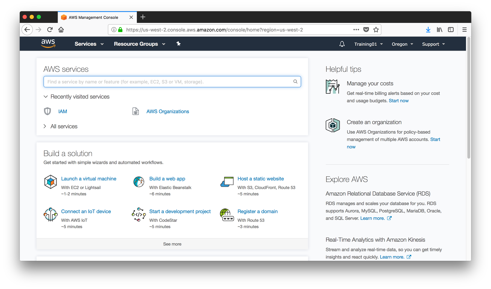
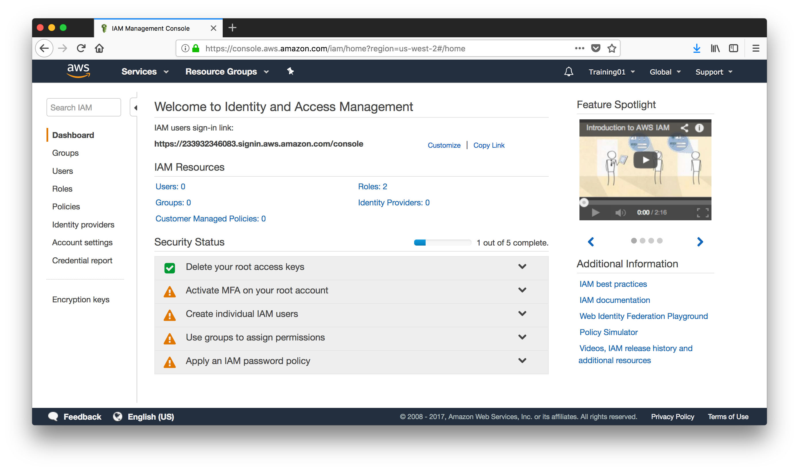
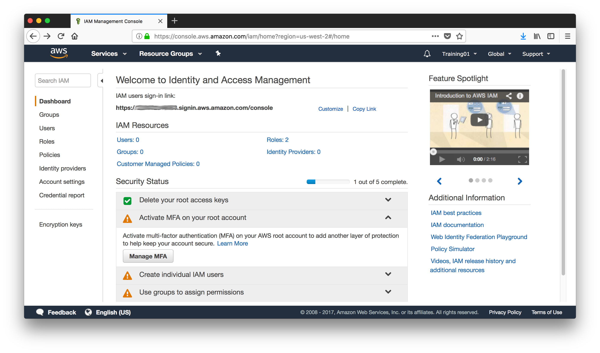

# Appendix 3: Initial Identity and Access Management for a New Account

There are a few security considerations regarding the access to your new AWS account that you may want to address. 

Log in to the **[AWS Console](https://console.aws.amazon.com)**. 

Navigate to **Identity and Access Management**. In the Dashboard you will find a number of warnings that are good practice to take care off.

First, activate Multi-Factor Authentication (MFA) to add an additional level of security. There are just too many bad actors out there and we don’t want to make life simple for them so expand the drop down element and click on **Manage MFA**.

