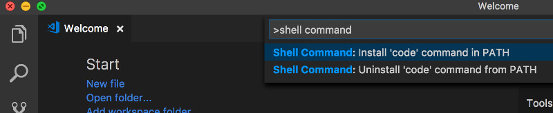

# Appendix 4: Preparing your Mac for Apache Cordova Development

To develop with Apache Cordova on a Mac and deploy to iOS, you will need.
* Xcode and the Command Line Tools for Xcode. You can install the former from the App Store and the letter by executing the following from the command line:

    ```text 
    xcode-select --install
    ```

* A Code Editor to work with your JavaScript and HTML5 code, I prefer [Visual Studio Code](https://code.visualstudio.com/) and use the following extensions for this workshop:
    * [Markdown All in One](https://marketplace.visualstudio.com/items?itemName=yzhang.markdown-all-in-one) for the documentation in Markdown
    * [Cordova Tools](https://marketplace.visualstudio.com/items?itemName=vsmobile.cordova-tools) for the mobile application development

    > Note: You can also run VS Code from the terminal by typing **code** after adding it to the path: A quick way to enable this capability is:

    * Launch VS Code
    * Open the Command Palette (⇧⌘P) and type **shell command** to find the command: **Install 'code' command in PATH**

        

    * Restart the terminal for the new $PATH value to take effect. You'll be able to type 

        ```text
        code .
        ``` 
        
        in any folder to start editing files in that folder.
    
* Node.js and NPM (Node Package Manager) as a pre-requisite for Apache Cordova. You can install Node through a platform installer or - if you could eventually use multiple versions of Node.js - better through the Node Version Manager (NVM). Here is how to install NVM, the latest Long Term Support (LTS) version of Node and NPM from the command line:

    Check first if you have a hidden file .bash_profile in your home directory. If you don't have one, create it by entering:

    ```text
    touch .bash_profile
    ```
    
    Now install NVM:

    ```text
    curl -o- https://raw.githubusercontent.com/creationix/nvm/v0.33.8/install.sh | bash
    ```

    Close and open the terminal window to apply the profile changes that NVM wrote to your shell. Test that NVM is installed by executing:

    ```text
    nvm --version
    ```

    Install the latest Node.js LTS version and NPM by executing:

    ```text
    nvm install --lts
    ```

    Now make this version the default by executing:

    ```text
    nvm use --lts
    ```

* Apache Cordova. Execute the following from the command line:

    ```text
    npm install -g cordova
    ```

    Next follow the platform specific guides outlined in the [documentation](https://cordova.apache.org/docs/en/latest/index.html#develop-for-platforms). To develop for iOS follow along here.

    * To install the iOS deployment tools for Apache Cordova execute the following from the command line:

        ```text
        npm install -g ios-deploy
        ```

    * The proxy that allows you to debug iOS code on the device or simulator directly from within Visual Studio Code can be installed via [Homebrew](https://brew.sh/). If you don't have Homebrew installed, you can do so by executing the following from the command line first:
     
        ```text
        /usr/bin/ruby -e "$(curl -fsSL https://raw.githubusercontent.com/Homebrew/install/master/install)"
        ```

    followed by the recipe for the proxy:

        ```text
        brew install ideviceinstaller ios-webkit-debug-proxy
        ```