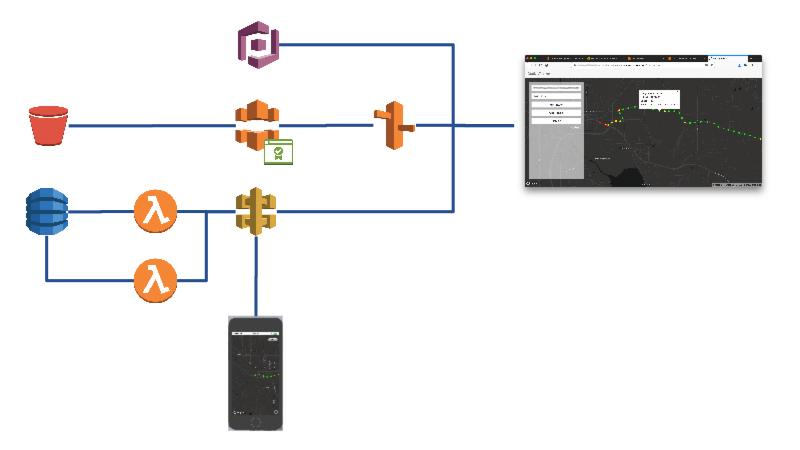

# WORK IN PROGRESS (DonkeyTracker Workshop)
In this self-guided workshop you will build an end-to-end serverless tracking application for your mobile devices powered by Amazon Web Services (AWS). 

The beauty of **serveless computing** is, that it allows you to focus entirely on your application rather than managing servers and scaling the environment. It is often also more cost efficient since you avoid overprovisioning and always have just the right capacity. This workshop is build around technologies such as DynamoDB, Lambda, API Gateway, Simple Storage Service (S3), CloudFront, Route 53 and Cognito.

## Requirements

* An **AWS Account**. If you don't have one yet, head over to [Appendix 3](./Appendix-03) to learn how to get one and configure the initial Identity and Access Management. You will also need an **AWS Access Key ID** and **AWS Secret Access Key** for some of the testing from the AWS CLI. [Appendix 3](./Appendix-03) also explains how to get the key.
* (Optional) A mobile device with an application for Multi-Factor Authentication (MFA) such as Google Authenticator ([Google PLay](https://play.google.com/store/apps/details?id=com.google.android.apps.authenticator2&hl=en) or [iTunes](https://itunes.apple.com/us/app/google-authenticator/id388497605?mt=8))
* A computer with access to the internet and where you have the rights to install software or that has already the following dependencies installed.
* A **Code Editor**. I prefer [Visual Studio Code](https://code.visualstudio.com/) and use the following extensions for this workshop:
    * [Markdown All in One](https://marketplace.visualstudio.com/items?itemName=yzhang.markdown-all-in-one) for the documentation in Markdown
    * [Cordova Tools](https://marketplace.visualstudio.com/items?itemName=vsmobile.cordova-tools) for the mobile application development
* [Postman](https://www.getpostman.com/) or a similar tool to craft and test HTTP POST requests.
* The mobile application is develped in [Apache Cordova](https://cordova.apache.org), a framework for the development of cross-platform, hybrid applications that translates HTML5 and JavaScript to native code. While you write the code only once and can deploy anywhere, the requirements for the development environment will vary depending on our development machine and the playtforms you develop for. If you build on a Mac and deploy to iOS you will find more details on how to set up the machine in [appendix 4](./Appendix-04). For other development machines and platforms check out the Apache Cordova [Get Started](https://cordova.apache.org/#getstarted) and the [platform specific guides](https://cordova.apache.org/docs/en/latest/index.html#develop-for-platforms).
* A [Mapbox](https://www.mapbox.com) account for the mapping part.

## Step 1: Persisting Data in DynamoDB Table

AWS provides many options to store and query data. For the type of data that we want to store in our tracking application, a database is probably most appropriate and AWS provides severeal managed and unmanaged services. While the recently announced [Amazon Aurora Serverless](https://aws.amazon.com/blogs/aws/in-the-works-amazon-aurora-serverless/) might be an option in the future we'll pick for now the already proven NoSQL database [Amazon DynamoDB](https://aws.amazon.com/dynamodb/). 

Head over to [step 1](./Step-01) to dive right in.

## Step 2: Writing Data to DynamoDB Table with Lambda

[AWS Lambda](https://aws.amazon.com/lambda/) lets you run code without provisioning or managing servers. You pay only for the compute time you consume - there is no charge when your code is not running. Lambda truely simplifies the development as long as your code meets the requirements, i.e. if you're developing APIs that don't require more than 5 min of execution time or 3 GB of memory it is pefect to get started quickly, avoid the management of servers and save cost. It is outside the scope of this workshop but for more complex scenarios where you may want to orchestrate multiple Lambda functions, have a look at [AWS Step Functions](https://aws.amazon.com/step-functions).

For now head over to [step 2](./Step-02) to create your Lambda function.

## Step 3: Exposing your Lambda Function through the API Gateway

[Amazon API Gateway](https://aws.amazon.com/api-gateway) is a service that enables developers to create, publish, maintain, monitor, and secure APIs at scale. You can create APIs that access AWS or other web services, as well as data stored in the AWS Cloud. Tere are several ways to athorize access to the API, including a simple API Key system with usage plans that allow you to throttle API requests. For this workshop you will take advantage of these usage plans to autorize access to the API.

So, head over to [step 3](./Step-03) to set up the API Gateway and create a method that triggers the Lambda function, you created in the pevious step.

## Step 4: The Mobile Device Application

As mentioned above you will develop this mobile application using Apache [Cardova](https://cordova.apache.org), a framework for building cross-platform, hybrid application that translates HTML 5 and JavaScript into native code to access certain device capacilities such as the GPS (or similar) chip that determines the location. This mobile application shall

* determine the device location, speed, heading, altitude and a few other things,
* send the data to your API Gateway, so that you can trigger the Lambda function and put it to the DynamoDB table
* and do so even if it runs in the background.

As mentioned in the **requirements**, your machine should be prepared for the development of Apache Cordova applications and if you build on a Mac and deploy to iOS you will find more details on how to set up the machine in [appendix 4](./Appendix-04). 

If you are ready to work with Apache Cordova, head over to [step 4](./Step-04).

## Step 5: Adding a Map to the Mobile Device Application

There are several good mapping services you can choose from when adding an interactive map to an Apache Cordova application: [Mapbox](https://www.mapbox.com/mapbox-gl-js/api/), [Bing Maps](https://www.bing.com/api/maps/sdkrelease/mapcontrol/isdk#overview), [Google Maps](https://developers.google.com/maps/documentation/javascript/), [HERE](https://developer.here.com/) or [TomTom](https://developer.tomtom.com/tomtom-maps-apis-developers) to name a few. Of course you can also use open data such as [OpenStreetMap](https://switch2osm.org/) to run your own mapping services. In fact, if you only want to serve maps as we do in this workshop, it isn't all that difficult and may in fact be more cost efficient than a 3rd party mapping services. Perhaps, we look at this in an optional step later on. For now you'll  work with Mapbox, a great service from a great company with lots of open source projects here on GitHub that has done some phenomenal work leveraging and contributing to OpenStreetMap and other related open source and open data projects. 

Head over to [step 5](./Step-05) to integrate Mapbox into your Cordova application.

## Step 6: Website Hosting with S3

[Amazon S3](https://aws.amazon.com/s3/) provides object storage with 11 9's of durability and can be easily configured to serve static websites. In the spirit of serverless application that's an ideal scenario for us. 

Navigate to [step 6](./Step-06) to get started. 

## Step 7: User Management with Cognito

For the authentication and authorization of access to your website you will use [Amazon Cognito](https://aws.amazon.com/cognito/). Cognito scales to millions of users, and supports sign-in with social identity providers such as Facebook, Google, and Amazon as well as enterprise identity providers via SAML 2.0. For this workshop you will work with Cognito **User Pools** rather than federating with identity providers.

Navigate to [step 7](./Step-07) to dive right in.

## Step 8: Adding Authentication and Authorization to your Website

In the previous 2 steps you have created your website and configured a Cognito User Pool to manage authentication and authorization. It is now time to configure your website to make use of the user pool.

Navigate to [step 8](./Step-08) to modify your website.

## Step 9: Create an API for your Website

With the structure and user management for your website in place, the final piece is to create an API that retrieves data from your DynamoDB table and displays it on the map. Creating the API is very similar to what you have already done in step 2 and 3. Therefore we'll go through this a bit quicker.

Head over to [step 9](./Step-09) to dive right in. 

## Step 10: Connect your Website to your New API

The code for your website is already prepared to call your newly created API but you still need to make a modification to config.js to provide the Invoke URL for your API Gateway and a key. In [step 10](./Step-10) you will make this final change.

## Step 11 (optional): Going to the Edge with CloudFront

[Coming Soon]

## Step 12 (optional): Set up a Domain

[Coming Soon]

## Step 13 (optional): WWW Domain Redirect

[Coming Soon]

## Step 14 (optional): Adding SSL Support

[Coming Soon]

## Step 15 (optional): Setting up a CI/CD Pipeline

[Coming Soon]

## [Appendix 1: References](./Appendix-01)
## [Appendix 2: Acronyms](./Appendix-02)
## [Appendix 3: Initial Identity and Access Management for a New Account](./Appendix-03)
## [Appendix 4: Preparing your Mac for Apache Cordova Development](./Appendix-04)
## [Appendix 5: Troubleshooting](./Appendix-05)