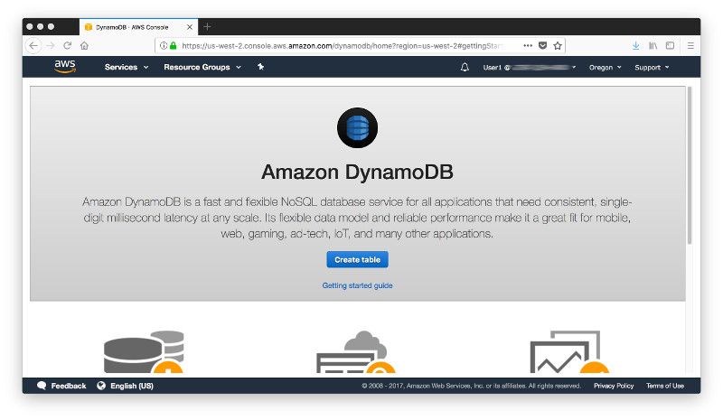
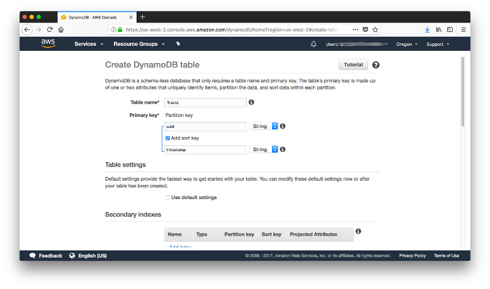
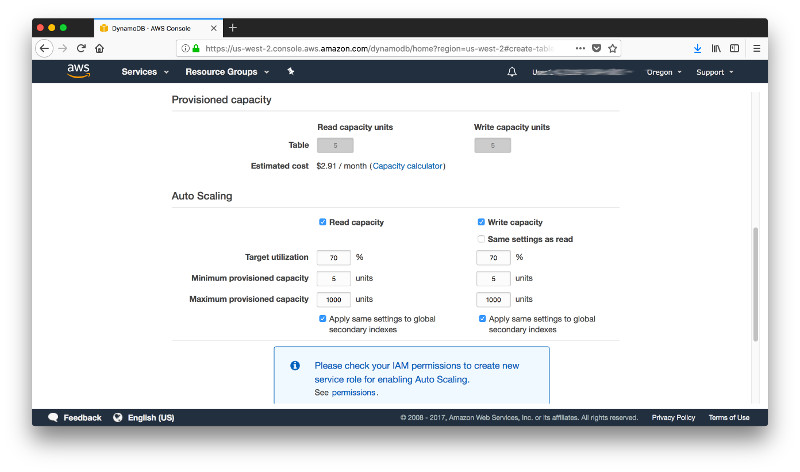
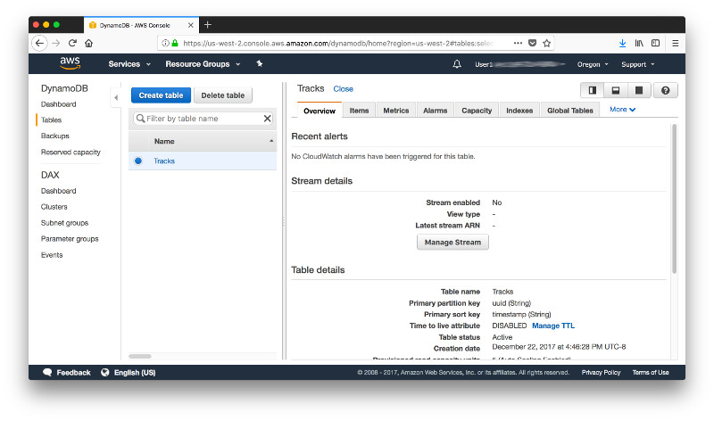
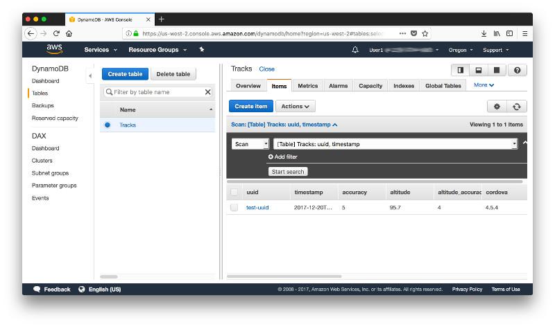
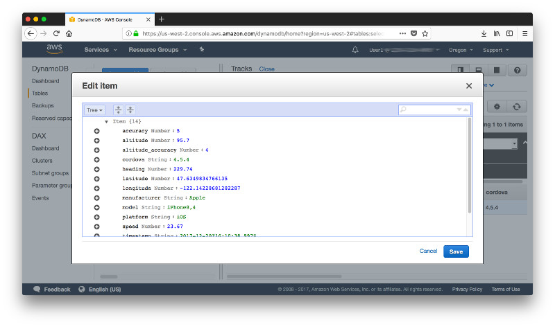

# Step 1: Persisting Data in DynamoDB Table

Log in to the **[AWS Console](https://console.aws.amazon.com)** and navigate to **DynamoDB**. In the top right pick a region that offers all the services we need for this workshop, i.e. **DynamoDB**, **Lambda**, **API Gateway** and **S3**. Oregon, aka us-west-2, would be a good choice. For an overview which service is available in what region check out [this page](https://aws.amazon.com/about-aws/global-infrastructure/regional-product-services/).



Give the table the name **Tracks**. DynamoDB manages table partitioning for you automatically, adding new partitions when necessary and distributing provisioned throughput capacity evenly across them. The primary key uniquely identifies each item in a table. It can be simple (partition key) or composite (partition key and sort key). The sort key is an item identifier and for this workshop you'll design the table with a composite primary key consisting of a **unique user ID** (uuid) as the partition key and a **timestamp** as the sort key. Both of these values are generated on our client application and will be covered in more detail when we come to that step. So go ahead and enter **uuid** as the **Primary Partion Key**, tick the box **Add a sort key** and enter **timestamp** as the **Primary Sort Key**. 

Many database workloads are cyclical in nature or are difficult to predict in advance. For this example of the tracking application, we can anticipate more traffic during the day, but there's no need for the same levels of throughput at night. Hence it is more cost efficient to scale the database resources up or down in response to varying usage levels. DynamoDB **auto scaling** uses the AWS Application Auto Scaling service to dynamically adjust provisioned throughput capacity in response to actual traffic patterns. In oder to configure auto scaling uncheck the box **Use default settings**.



Now scroll down and configure the read and write capacity. These cacacipty units are measured in item reads per second. This is a factastic way to determine the scale of your database and takes the guess work out of the picture. 

One read capacity unit equals one strongly consistent read per second, or two eventually consistent reads per second, for items up to 4 KB in size.

One write capacity unit equals one write per second, for items up to 1 KB in size. 

You can keep the defaults as is or reduce the **Maximum provisioned capacity** to a more modest value (here 1,000). Now click on **Create** and the table will be provisioned for you. No need to worry about servers, scaling or load balancing. 



Once the table is provisioned, you'll be redirectd to the dashboard and you are ready to test. 



At this point we don't have all the pieces in place but we can test from the AWS CLI. If you haven't configured the AWS CLI yet, you can follow the steps described [here](http://docs.aws.amazon.com/cli/latest/userguide/installing.html). The document refers to an installation using Python and PIP but if you're using a Mac and have Homebrew installed you can take a shortcut entering:

```
brew install awscli
```

Once the installation is complete you can configure the credentials and defaults by entering the command:

```
aws configure
```

The configration will prompt you to enter the **AWS Access Key ID** as well as the **AWS Secret Access Key** (see also [Appendix 3: Initial Identity and Access Management for a New Account](../Appendix-03)). For the **Default region name** choose the one where you created your DynamoDB table. If you chose **Oregon** enter **us-west-2**.

> Note: You can always append the option **--region us-west-2** if you want to override the default region.

The command to write an item from the AWS CLI to DynamoDB has the following syntax. 

```txt
aws dynamodb put-item --table-name [YOUR_TABLE_NAME] --item file://[YOUR_FILE_NAME] --return-consumed-capacity TOTAL
```

Before we execute this command we need to create a file - let's call it sampleItem.json - with a JSON-object as shown below. Don't worry for now about what all this is, we get into more detail when we look at the client application.

```json
{
    "latitude": {"N": "47.6349834766135"},
    "longitude": {"N": "-122.14228681282287"},
    "accuracy": {"N": "5"},
    "heading": {"N": "229.74"},
    "speed": {"N": "23.67"},
    "altitude": {"N": "95.7"},
    "altitude_accuracy": {"N": "4"},
    "manufacturer": {"S": "Apple"},
    "model": {"S": "iPhone8,4"},
    "platform": {"S": "iOS"},
    "version": {"S": "11.2.1"},
    "uuid": {"S": "test-uuid"},
    "cordova": {"S": "4.5.4"},
    "timestamp": {"S": "2017-12-20T16:10:38.997Z"}
}
```

Now open a command shell, navigate to the folder where you stored the sampleItem.json and execute the following cmmand:

```txt
aws dynamodb put-item --table-name Tracks --item file://sampleItem.json --return-consumed-capacity TOTAL
```

A successful response will look like this:

```json
{
    "ConsumedCapacity": {
        "TableName": "Tracks",
        "CapacityUnits": 1.0
    }
}
```

Now head back to the browser where you have the AWS Console with the DynamoDB table open and check the tabulator **Items**. You should see 1 item and when you click on it...



...you should see the details of the item you just submitted from the AWS CLI.



And that's it for step 1. You just created a DynamoDB table and submitted a first sample item from the AWS CLI. You are now ready to move on to [step 2](../Step-02).