# Step 2: Writing Data to DynamoDB Table with Lambda

Log in to the **[AWS Console](https://console.aws.amazon.com)** and navigate to **Lambda**. Make sure you are in the same region as the one where you created the DynamoDB table. If this is the first Lambda function you create in this account, you will be greeted with a screen like the one below. Click on **Create Function**.

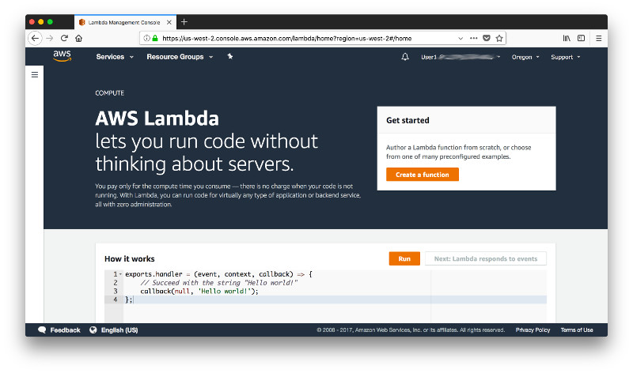

Keep the default of **Author from sctatch**, give the function the name **locations** and leave the runtime at the default **Node.js 6.10**. There are many programming languages you can leverage to develop Lambda functions but in this workshop we'll use server-side JavaScript.

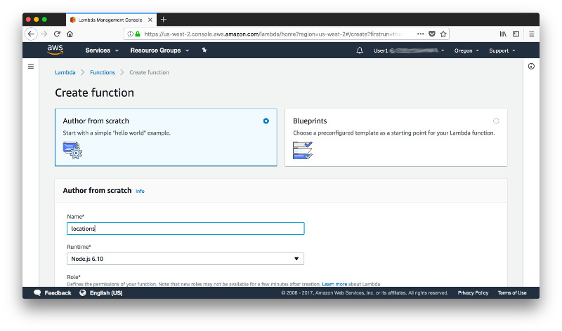

Now scroll down and for the execution role pick **Create a custom role**. This is where we define the priviliges that the function can have by assuming an IAM role. By default Lambda functions have only the right to create and write into log-files but our function shall also put items into DynamoDB.

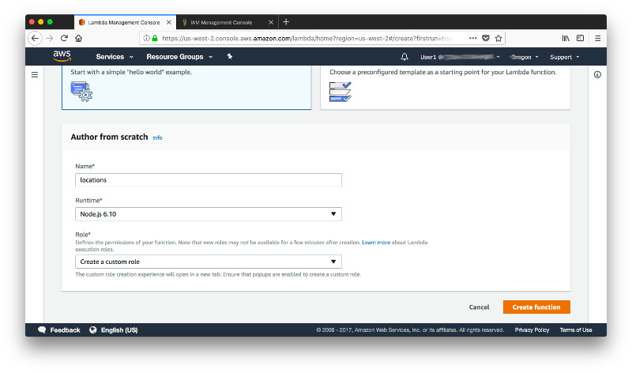

When you select **Create a custom role**, you'll be automatically re-directed to the IAM console. Give the role a name (here **DonkeyTrackerLambda**) and click **Edit** next to the policy document.

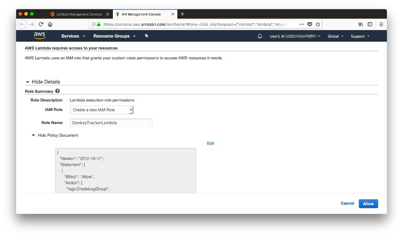

Acknowledge that you need to know what you are doing...

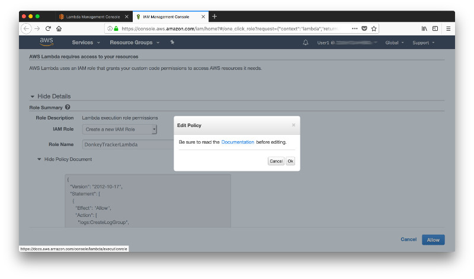

...and append the following policy to the policy document just after the one that allows the logging.

```json
,{
    "Effect": "Allow",
    "Action": [
        "dynamodb:DescribeTable",
        "dynamodb:Query",
        "dynamodb:Scan",
        "dynamodb:GetItem",
        "dynamodb:PutItem",
        "dynamodb:UpdateItem",
        "dynamodb:DeleteItem"
    ],
    "Resource": "arn:aws:dynamodb:us-west-2:*:*"
}
```

The policy above will work but is fairly broad and would allow any inserts, updates and deletes on all DynamoDB tables in the region **us-west-2**. We can further restrict the rights to just the table **Tracks** by replacing the wildcards in the resource ARN (Amazon Resource Name) with the specific values for our DynamoDB table **Tracks**. To get these values open a new tab in your browser and navigate to your DynamoDB table **Tracks**. You will find the ARN in the tab **Overview**. 

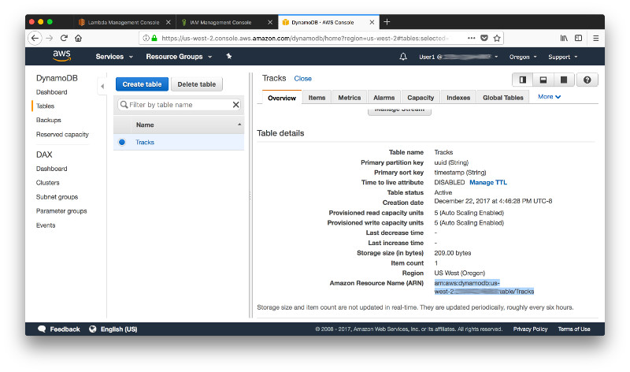

Keep that tab open - we'll need it shortly - but head back to the browser tab with the IAM console and replace the **Resource** for the rights on DynamoDB with your specific ARN for the table. The full policy document that restricts the data manipulation priviliges to just the table **Tracks** will look like this (replace the string **[YOUR_ACCOUNT_ID]** with your AWS accout ID).

```json
{
    "Version": "2012-10-17",
    "Statement": [
        {
            "Effect": "Allow",
            "Action": [
                "logs:CreateLogGroup",
                "logs:CreateLogStream",
                "logs:PutLogEvents"
            ],
            "Resource": "arn:aws:logs:*:*:*"
        },
        {
            "Effect": "Allow",
            "Action": [
                "dynamodb:DescribeTable",
                "dynamodb:Query",
                "dynamodb:Scan",
                "dynamodb:GetItem",
                "dynamodb:PutItem",
                "dynamodb:UpdateItem",
                "dynamodb:DeleteItem"
            ],
            "Resource": "arn:aws:dynamodb:us-west-2:[YOUR_ACCOUNT_ID]:table/Tracks"
        }
    ]
}
```

Once you finished editing click on **Allow**.

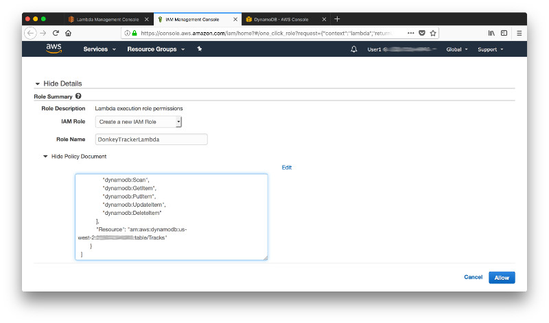

The browser tab with the IAM console will close and you are back in the browser tab for your Lambda function. From the drop down list **Existing role** pick the newly created role **DonkeyTrackerLambda** and click on **Create function**. 

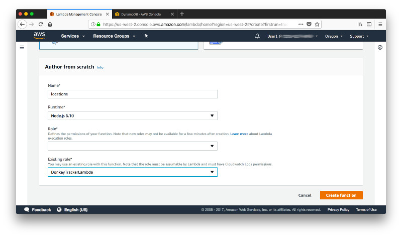

Once the function is created, you will see in the designer that it has access to **CloudWatch Logs** and **DynamoDB**.

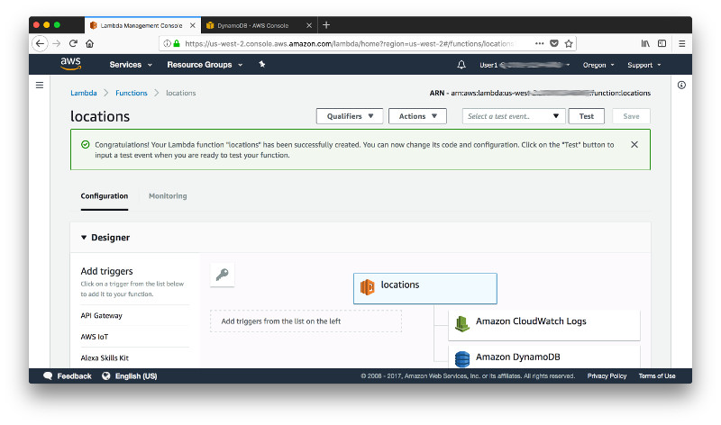

Now paste the following code in the inline code editor. This is the Node.js code for the function that requires the AWS SDK, defines the region and DynamoDB endpoint in the config and instantiates a DynamoDB client. It then creates a handler which we will later map to a HTTP endpoint to which we can POST. It parses the body of the event that triggered the function (that will be later an incoming HTTP POST request) into a JSON object and creates a new JSON object that we can put into the DynamoDB table. You also allow CORS and return a HTTP response with the status code 200 for a successful insert or a 500 for an error.

```javascript
var AWS = require("aws-sdk");

AWS.config.update({
    region: "us-west-2",
    endpoint: "https://dynamodb.us-west-2.amazonaws.com"
});

var docClient = new AWS.DynamoDB.DocumentClient();

exports.handler = (event, context, callback) => {
    // Request body is passed in as a JSON encoded string in 'event.body'
    const data = JSON.parse(event.body);
    console.log(data);

    var params = {
        TableName: "Tracks",
        Item: {
            'uuid': data.device.uuid,
            'timestamp': data.location.timestamp,
            'longitude': data.location.coords.longitude,
            'latitude': data.location.coords.latitude,
            'speed': data.location.coords.speed,
            'accuracy': data.location.coords.accuracy,
            'heading': data.location.coords.heading,
            'is_moving': data.location.coords.is_moving,
            'altitude': data.location.coords.altitude,
            'altitude_accuracy': data.location.coords.altitude_accuracy,
            'manufacturer': data.device.manufacturer,
            'platform': data.device.platform,
            'version': data.device.version,
            'model': data.device.model,
            'cordova': data.device.cordova
        }
    }
    
    docClient.put(params, (error, data) => {
    // Set response headers to enable CORS (Cross-Origin Resource Sharing)
    const headers = {
      "Access-Control-Allow-Origin": "*",
      "Access-Control-Allow-Credentials": true
    };

    // Return status code 500 on error
    if (error) {
      const response = {
        statusCode: 500,
        headers: headers,
        body: JSON.stringify({ status: false })
      };
      callback(null, response);
      return;
    }

    // Return status code 200 and the newly created item
    const response = {
      statusCode: 200,
      headers: headers,
      body: JSON.stringify(params.Item)
    };
    callback(null, response);
  });
};
```

Once you have pasted the code into the editor click on **Save**. 

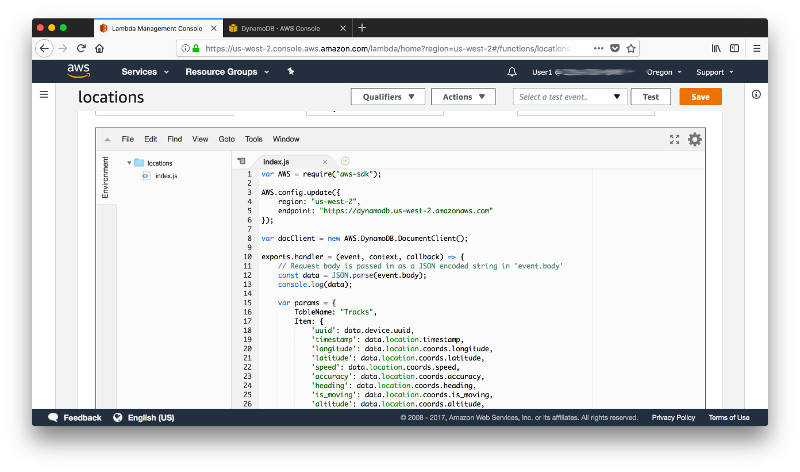

Next you configure a test event. From the dropdown at the top-right of the page select **Configure test event**.

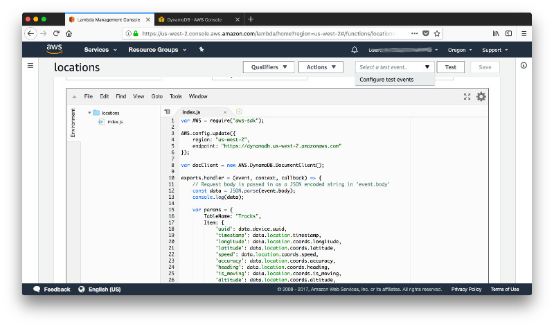

Keep the default **Hello World** template and post the following JSON object in the inline editor; then click **Save**. This object is similar to the body of the HTTP POST request that our client application will send to the service.

```json
{
  "body": "{\"location\":{\"coords\":{\"speed\":34.549999999999997,\"longitude\":-122.38515208,\"latitude\":37.562428439999998,\"accuracy\":5,\"altitude_accuracy\":-1,\"altitude\":0,\"heading\":321.32999999999998},\"extras\":{},\"is_moving\":true,\"odometer\":1300163.6000000001,\"uuid\":\"375ED607-AD1D-44B7-9589-D9FC2A8581BA\",\"activity\":{\"type\":\"unknown\",\"confidence\":100},\"battery\":{\"level\":-1,\"is_charging\":false},\"timestamp\":\"2017-12-19T19:09:54.118Z\"},\"device\":{\"version\":\"11.2\",\"uuid\":\"F94B1D50-4A78-48D6-8AB1-D62F3DB91DBA\",\"model\":\"x86_64\",\"manufacturer\":\"Apple\",\"cordova\":\"4.5.4\",\"platform\":\"iOS\"}}"
}
```

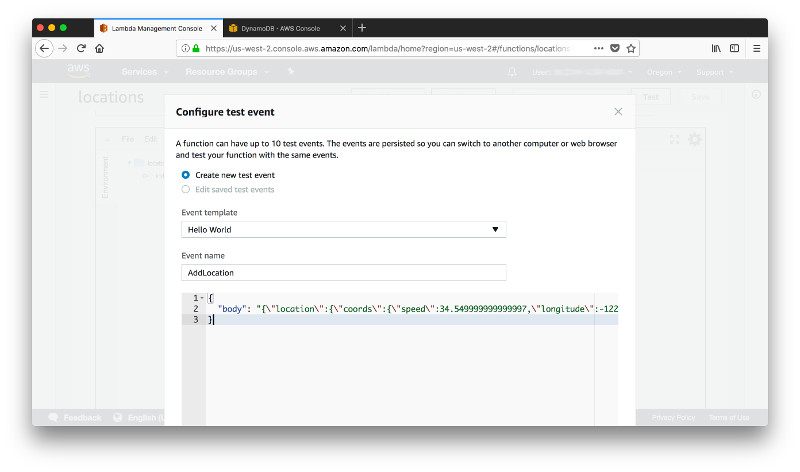

Now click on **Test** to verify that everything so far works as expected. Note, that the response includes some debug information on the time it took to execute the function (that is relevant for billing and cost analysis) as well as memory consumption. For this function the defaults are perfectly fine but for more resource intensive computations you might find a hint here to adjust the **Timeout** and **Memory** of the function.

```text
REPORT RequestId: 5e9ffec1-e8ce-11e7-a70c-bddd9e67d969	Duration: 1260.78 ms	Billed Duration: 1300 ms 	Memory Size: 128 MB	Max Memory Used: 39 MB	
```

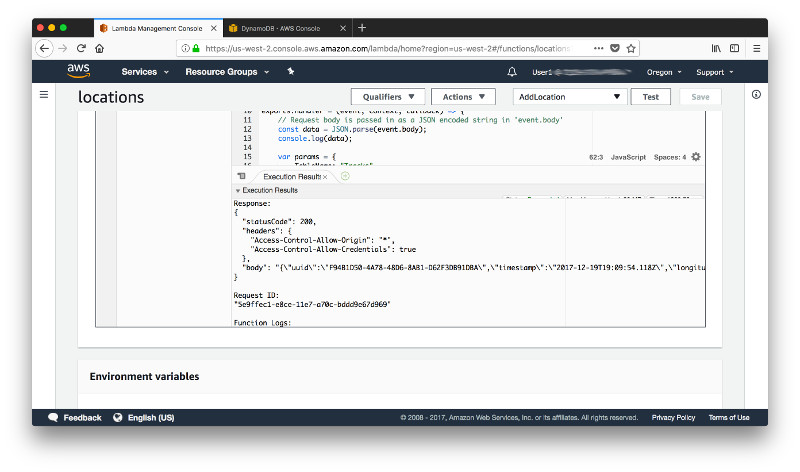

Head over to the browser tab with the DynamoDB table, navigate to the tab **Items** and verify that the documet has indeed been added to your table.

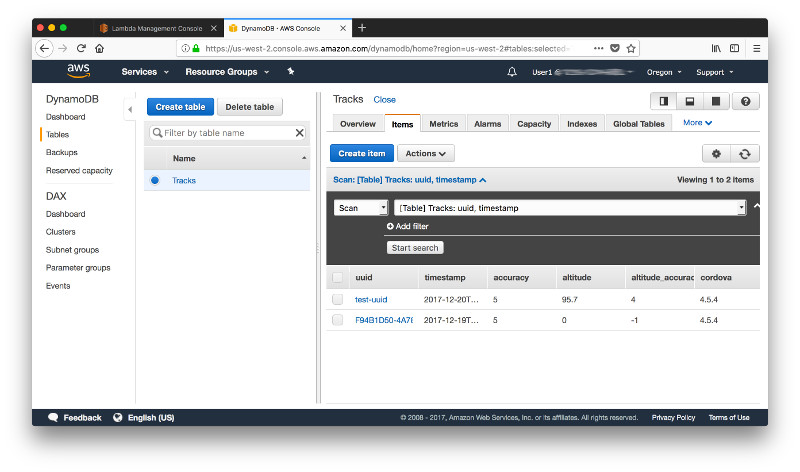

And that's it for step 2. You just created a Lambda function that can write to your DynamoDB table and verified that it can indeed write to your database. You are now ready to move on to [step 3](../Step-03).