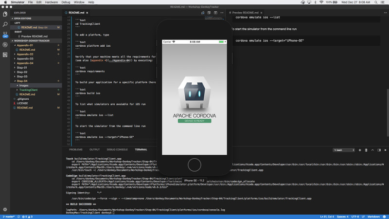
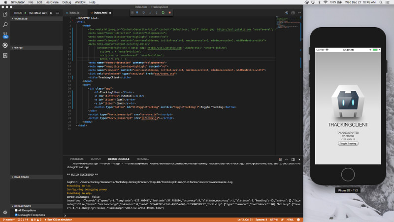
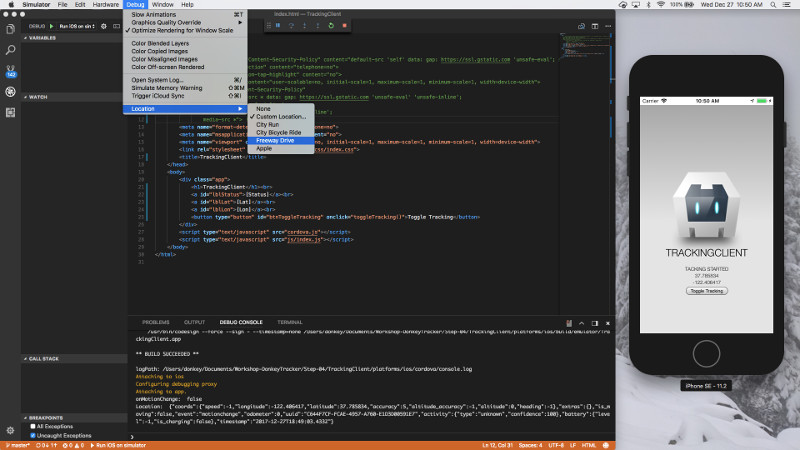
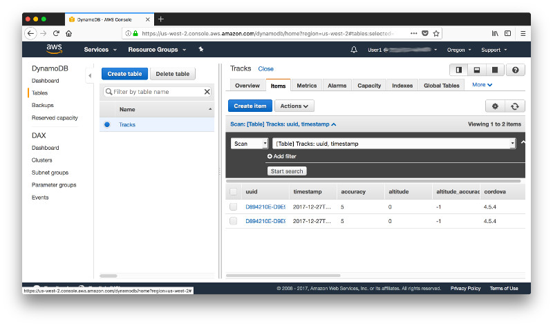

# Step 4: The Mobile Device Application

## Getting Started

Let's first verify that our development environment is set up properly and everything works as expected by building and simulating the **Get Started** Cordova application:

> Tip: If you are using [Visual Studio Code](https://code.visualstudio.com/) as your code editor you may have already noticed that it has a build in terminal. This is quite useful when you have to develop both from the command line and the code editor since you don't need to switch between windows.

Create a blank Cordova project using the command line tool. Navigate to the directory where you wish to create your project and type

```text
cordova create TrackingClient net.talkingdonkey.trackingclient TrackingClient
```

For a complete set of options, type cordova help create. 

After creating a Cordova project, navigate to the project directory. 

```text
cd TrackingClient
```

To add a platform, type

```text
cordova platform add ios
```

Verify that your machine meets all the requirements for developing Apache Cordova apps (see also [appendix 4](../Appendix-04)) by executing:

```text
cordova requirements
```

You should get a response like:

```text
Requirements check results for ios:
Apple macOS: installed darwin
Xcode: installed [object Object]
ios-deploy: installed [object Object]
CocoaPods: installed [object Object]
DonkeyMac:TrackingClient donkey$
```

To build your application for a specific platform (here iOS) enter

```text
cordova build ios
```

To list what simulators are avaiable for iOS run

```text
cordova emulate ios --list
```

To start the simulator from the command line run

```text
cordova emulate ios --target="iPhone-SE"
```



If you want to debug from Visual Studio Code, you will have to add a launch configuration. To do so, navigate to the **Debug** menu and click on **Add Configuration** in the dropdown list. Pick **Cordova** from the available options.


This will automatically create a file **launch.json** in the hidden folder **.vscode**. There are a few things that you need to adjust when you want to debug in the simulator. 

* It takes a while for the iPhone simulator or Android emulator to start and the default settings in the lauch.json will hit a timeout before the start-up of the simulator / emulator is complete. In order to prevent this timeout we can add new properties for **attachAttempts** and **attachDelay**.  
* Optional: If you want a specific simulator you can modify the property **target**.

An example of the launch plan for the iOS simulator that starts the **iPhone SE** image is shown below:

```json
{
    "name": "Run iOS on simulator",
    "type": "cordova",
    "request": "launch",
    "platform": "ios",
    "target": "iPhone-SE",
    "port": 9220,
    "sourceMaps": true,
    "cwd": "${workspaceRoot}",
    "ionicLiveReload": false,
    "attachAttempts": 5,
    "attachDelay": 10000
},
```

## Adding the Background Location Tracking

There are a few Apache Cordova plug-ins for background location tracking. I like [Cordova Background Geolocation](https://github.com/transistorsoft/cordova-background-geolocation-lt) from [Transistor Software](https://www.transistorsoft.com/) which is battery conscious, works on iOS and Android and also supports geo-fencing. To install it in your Apache Cordova project simply execute:

```text
cordova plugin add cordova-background-geolocation-lt
```

We will also need another plugin to retrieve certain information about the device such as device manufacturer, model, platform and version.

```text
cordova plugin add cordova-plugin-device
```

Now let's hook up the background geolocation plugin to your application code. The only place where we from now on manually touch the code is in the **www** directory of your Cordova project. In the subfolder **js** you see what happens in the default template app. You will find that when the application is initialized it adds a handler for the event **deviceready**. When that event is triggered it exceutes a function  **onDeviceReady**. 

**index.html** is the webpage that defines the user interface.

Let's modify these 2 files. In **index.html** we add a few HTML elements to allow us to start and stop the plugin and monitor the status. Also note, that in the header we change the content security policy to allow unsafe inline code. We use it here to trigger a function when we click a button.

```html
<!DOCTYPE html>
<html>
    <head>
        <meta http-equiv="Content-Security-Policy" 
              content="default-src * data: gap: https://ssl.gstatic.com 'unsafe-eval' 'unsafe-inline'; 
                style-src * 'unsafe-inline'; 
                script-src * 'unsafe-eval' 'unsafe-inline';
                media-src *">
        <meta name="format-detection" content="telephone=no">
        <meta name="msapplication-tap-highlight" content="no">
        <meta name="viewport" content="user-scalable=no, initial-scale=1, maximum-scale=1, minimum-scale=1, width=device-width">
        <link rel="stylesheet" type="text/css" href="css/index.css">
        <title>TrackingClient</title>
    </head>
    <body>
        <div class="app">
            <h1>TrackingClient</h1><br>
            <a id="lblStatus">[Status]</a><br>
            <a id="lblLat">[Lat]</a><br>
            <a id="lblLon">[Lon]</a><br>
            <button type="button" id="btnToggleTracking" onclick="toggleTracking()">Toggle Tracking</button> 
        </div>
        <script type="text/javascript" src="cordova.js"></script>
        <script type="text/javascript" src="js/index.js"></script>
    </body>
</html>
```

In **index.js** we configure the background location plugin, start and stop it and configure the API endpoint we send data to. Look in the code for the place holders 

* [YOUR API INVOKE URL] and
* [YOUR API KEY]

and replace it with the values for the API Gateway and API key that you generated in [step 3](../Step-03).

For a full documentation on **Cordova Background Geolocation** check out the GitHub page [here](https://github.com/transistorsoft/cordova-background-geolocation-lt).

```javascript
var bgGeo;
var tracking = false;

var app = {
    // Application Constructor
    initialize: function () {
        document.addEventListener('deviceready', this.onDeviceReady.bind(this), false);
    },

    // deviceready Event Handler
    onDeviceReady: function () {
        // Get a reference to the plugin.
        bgGeo = window.BackgroundGeolocation;

        //This callback will be executed every time a geolocation is recorded in the background.
        var callbackFn = function (location) {
            var coords = location.coords;
            var lat = coords.latitude;
            document.getElementById('lblLat').innerHTML = coords.latitude;
            var lng = coords.longitude;
            document.getElementById('lblLon').innerHTML = coords.longitude;
            console.log('Location: ', JSON.stringify(location));
        };

        // This callback will be executed if a location-error occurs.  Eg: this will be called if user disables location-services.
        var failureFn = function (errorCode) {
            console.warn('BackgroundGeoLocation error: ', errorCode);
        }

        // Listen to location events & errors.
        bgGeo.on('location', callbackFn, failureFn);

        // Fired whenever state changes from moving->stationary or vice-versa.
        bgGeo.on('motionchange', function (isMoving) {
            console.log('onMotionChange: ', isMoving);
        });

        // Fired whenever a geofence transition occurs.
        bgGeo.on('geofence', function (geofence) {
            console.log('onGeofence: ', geofence.identifier, geofence.location);
        });

        // Fired whenever an HTTP response is received from your server.
        bgGeo.on('http', function (response) {
            console.log('http success: ', response.responseText);
        }, function (response) {
            console.log('http failure: ', response.status);
        });

        bgGeo.configure({
            // Geolocation config
            desiredAccuracy: 0,
            distanceFilter: 10,
            stationaryRadius: 25,
            // Activity Recognition config
            activityRecognitionInterval: 10000,
            stopTimeout: 5,
            // Application config
            debug: false, // Debug sounds & notifications.
            stopOnTerminate: false,
            startOnBoot: false,
            // HTTP config
            url: "[YOUR API INVOKE URL]",
            method: "POST",
            autoSync: true,
            maxDaysToPersist: 3,
            headers: {
                "x-api-key": "[YOUR API KEY]"
            },
            params: {
                device: {
                    platform: device.platform,
                    version: device.version,
                    uuid: device.uuid,
                    cordova: device.cordova,
                    model: device.model,
                    manufacturer: device.manufacturer
                }
            },
            // iOS-specific
            activityType: 'other'
        }, function (state) {
            // This callback is executed when the plugin is ready to use.
            console.log("BackgroundGeolocation ready: ", state);
            if (!state.enabled) {
                document.getElementById('lblStatus').innerHTML = 'Plugin Ready';
                //bgGeo.start();
            }
        }, function (error) {
            console.log("Background Geolocation failed to configure:" + error);
        });
    }
};

app.initialize();

function toggleTracking() {
    if (tracking == false) {
        tracking = true;
        bgGeo.start();
        document.getElementById('lblStatus').innerHTML = 'Tacking Started';
    } else {
        bgGeo.stop();
        document.getElementById('lblStatus').innerHTML = 'Tacking Stopped';
        document.getElementById('lblLat').innerHTML = "";
        document.getElementById('lblLon').innerHTML = "";
    }
}
```

Once you saved your changes deploy your application to the simulator and start the plugin. You should see the latitude and longitude change in the user interface and the debug messages in the **Debug Console** of Visual Studio Code.



By default the simulator returns one stationary location but you can change the behavior in the **Debug** => **Location** menu of the simulator. In the example the simulation changes to a **Freeway Drive**.



Verify that the data has indeed been written to your DynamoDB table.



## Adding a Map

[coming soon]

