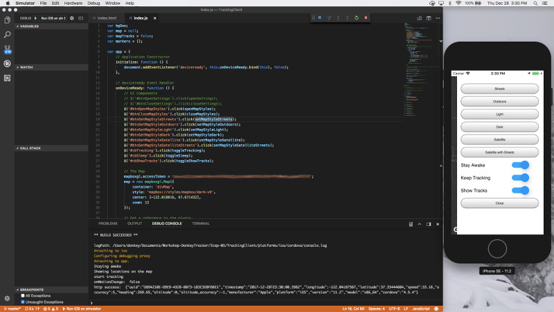
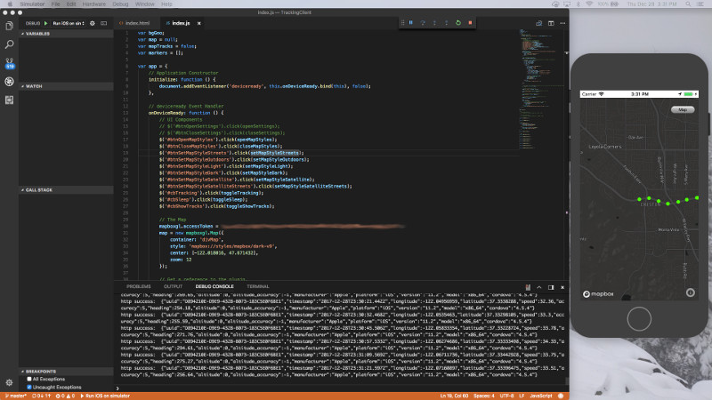
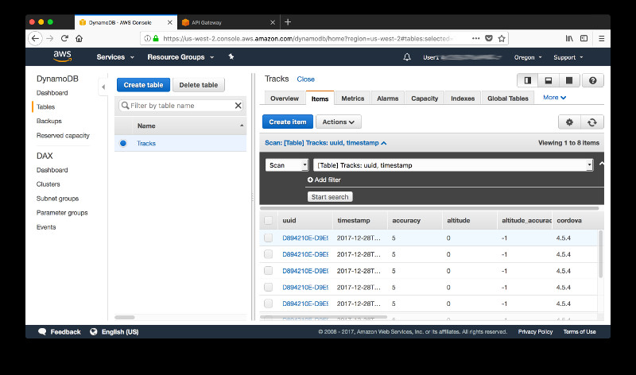

# Step 5: Adding a Map to the Mobile Device Application

You have a working mobile application leveraging Apache Cordova that tracks the location of your mobile device and sends the data to your AWS backend but what is a location based service without a map? During this workshop you will use Mapbox and you can sign up [here](https://www.mapbox.com) for a developer account with a generous free tier. Mapbox provides several SDKs - including some for native iOS and Android applications as well as Unity but for this hybrid application you'll use [Mapbox GL](https://www.mapbox.com/mapbox-gl-js/api/) which serves vector tiles that support client-side styling in a JavaScript API. You can choose from a number of pre-defined styles or create your own in **Mapbox Studio**. In this step you will add Mapbox GL to your mobile application as well as a few options to control the background geolocation plugin. Head over to [Mapbox](https://www.mapbox.com) and [create a new access token](https://www.mapbox.com/studio/account/tokens/)

Building upon the app you created in [step 4](../Step-04), you'll start by adding a new NPM package that will prevent your screen from going to sleep:  [Insomnia](https://github.com/EddyVerbruggen/Insomnia-PhoneGap-Plugin). This is useful when you want to keep an eye on the tracked locations during a test drive or run. To install **Insomnia** execute:

```text
cordova plugin add https://github.com/EddyVerbruggen/Insomnia-PhoneGap-Plugin.git
```

Now tend to the 3 components of your application - **index.html**, **index.js** and **index.css** in the folder **www** - starting with the HTML document. Remove all the UI componets from the previous steps. Instead of showing a bunch of numbers and strings, you will display your GPS tracks on a map. Next, referece the Mapbox stylesheet in the header and the JavaScript in the body of your HTML document. Also add a DIV element that will hold the map, [jQuery](https://jquery.com/) and a sliding panel to your body. You can either referece jQuery through a Content Delivery Network (CDN) or download it and copy the files into your folder **js**. For a mobile application the latter is preferable since it reduces the number of network calls. The sliding panel holds buttons and toggle switches to

* change the map style,
* start and stop tracking,
* toggle the sleep preventions and
* add or remove GPS tracks as markers on the map

```html
<!DOCTYPE html>
<html>
    <head>
        <meta name="format-detection" content="telephone=no">
        <meta name="msapplication-tap-highlight" content="no">
        <meta name="viewport" content="user-scalable=no, initial-scale=1, maximum-scale=1, minimum-scale=1, width=device-width">
        <link href='https://api.tiles.mapbox.com/mapbox-gl-js/v0.43.0/mapbox-gl.css' rel='stylesheet' />
        <link rel="stylesheet" type="text/css" href="css/index.css">
        <title>TrackingClient</title>
    </head>
    <body>
        <div id='divMap'></div>

        <div class="panelRight">
            <div id="panelElementsRight" style="position:relative; top:20px; left:10px;">
                <table>
                    <tr>
                        <td colspan="2" style="height:40px">
                            <button type="button" id="btnSetMapStyleStreets" style="width:270px;height:35px">Streets</button>
                        </td>
                    </tr>
                    <tr>
                        <td colspan="2" style="height:40px">
                            <button type="button" id="btnSetMapStyleOutdoors" style="width:270px;height:35px">Outdoors</button>
                        </td>
                    </tr>
                    <tr>
                        <td colspan="2" style="height:40px">
                            <button type="button" id="btnSetMapStyleLight" style="width:270px;height:35px">Light</button>
                        </td>
                    </tr>
                    <tr>
                        <td colspan="2" style="height:40px">
                            <button type="button" id="btnSetMapStyleDark" style="width:270px;height:35px">Dark</button>
                        </td>
                    </tr>
                    <tr>
                        <td colspan="2" style="height:40px">
                            <button type="button" id="btnSetMapStyleSatellite" style="width:270px;height:35px">Satellite</button>
                        </td>
                    </tr>
                    <tr>
                        <td colspan="2" style="height:40px">
                            <button type="button" id="btnSetMapStyleSatelliteStreets" style="width:270px;height:35px">Satellite with Streets</button>
                        </td>
                    </tr>
                    <tr>
                        <td style="height:40px">Stay Awake</td>
                        <td>
                            <div class="onoffswitch">
                                <input type="checkbox" name="onoffswitch6" class="onoffswitch-checkbox" id="cbSleep">
                                <label class="onoffswitch-label" for="cbSleep"></label>
                            </div>
                        </td>
                    </tr>
                    <tr>
                        <td style="height:40px">Keep Tracking</td>
                        <td>
                            <div class="onoffswitch">
                                <input type="checkbox" name="onoffswitch5" class="onoffswitch-checkbox" id="cbTracking">
                                <label class="onoffswitch-label" for="cbTracking"></label>
                            </div>
                        </td>
                    </tr>
                    <tr>
                        <td style="height:40px">Show Tracks</td>
                        <td>
                            <div class="onoffswitch">
                                <input type="checkbox" name="onoffswitch7" class="onoffswitch-checkbox" id="cbShowTracks">
                                <label class="onoffswitch-label" for="cbShowTracks"></label>
                            </div>
                        </td>
                    </tr>
                    <tr>
                        <td colspan="2" style="height:40px">
                            <button type="button" id="btnCloseMapStyles" style="width:270px;height:35px">Close</button>
                        </td>
                    </tr>
                </table>
            </div>
        </div>
        <button type="button" id="btnOpenMapStyles">Map</button>
            
        <script src='https://api.tiles.mapbox.com/mapbox-gl-js/v0.43.0/mapbox-gl.js'></script>
        <script type="text/javascript" src="cordova.js"></script>
        <script type="text/javascript" src="js/jquery-2.2.4.min.js"></script>
        <script type="text/javascript" src="js/index.js"></script>
    </body>
</html>
```

Next, replace the styles in **index.css** with the ones below.

```css
body {
    overflow: hidden !important;
    width:100vw;
    height:100vh;
    font-family: Calibri, sans-serif;
}

#divMap{
    position:absolute;
    top:0px;
    left:0px;
    width:100%;
    height:100%;
}

.panelRight {
    z-index:2000;
    width:300px;
    margin-right:-300px; 
    height:100%; 
    background:white;
    position:absolute; 
    right:0px;
    top:0px;
}

#btnOpenMapStyles {
    z-index:1000;
    position:absolute;
    right:10px;
    top:20px;
    width:65px;
}

.onoffswitch {
    position: relative; width: 55px;
    -webkit-user-select:none; 
    -moz-user-select:none; 
    -ms-user-select: none; 
    user-select: none;
}

.onoffswitch-checkbox {
    display: none;
}

.onoffswitch-label {
    display: block; overflow: hidden; cursor: pointer;
    height: 20px; padding: 0; line-height: 20px;
    border: 0px solid #FFFFFF; border-radius: 30px;
    background-color: #9E9E9E;
}

.onoffswitch-label:before {
    content: "";
    display: block; width: 30px; margin: -5px;
    background: #FFFFFF;
    position: absolute; top: 0; bottom: 0;
    right: 31px;
    border-radius: 30px;
    box-shadow: 0 6px 12px 0px #757575;
}

.onoffswitch-checkbox:checked + .onoffswitch-label {
    background-color: #42A5F5;
}

.onoffswitch-checkbox:checked + .onoffswitch-label, .onoffswitch-checkbox:checked + .onoffswitch-label:before {
    border-color: #42A5F5;
}

.onoffswitch-checkbox:checked + .onoffswitch-label .onoffswitch-inner {
    margin-left: 0;
}

.onoffswitch-checkbox:checked + .onoffswitch-label:before {
    right: 0px; 
    background-color: #2196F3; 
    box-shadow: 3px 6px 18px 0px rgba(0, 0, 0, 0.2);
}
```

Finally, replace the JavaScript in **index.js**. The code to control the background geolocation plugin is mostly the same but you wire some functions to the panel-button, add the map and change the callback function that triggers when you receive a new location from the GPS.

> Note, that you need to replace the strings **[YOUR API INVOKE URL]** with the invoke URL for your own API Gateway, **[YOUR API KEY]** your own API key and **[YOUR MAPBOX KEY]** with your own Mapbox access token.

```javascript
var bgGeo;
var map = null;
var mapTracks = false;
var markers = [];

var app = {
    // Application Constructor
    initialize: function () {
        document.addEventListener('deviceready', this.onDeviceReady.bind(this), false);
    },

    // deviceready Event Handler
    onDeviceReady: function () {
        // UI Components
        $('#btnOpenMapStyles').click(openMapStyles);
        $('#btnCloseMapStyles').click(closeMapStyles);
        $('#btnSetMapStyleStreets').click(setMapStyleStreets);
        $('#btnSetMapStyleOutdoors').click(setMapStyleOutdoors);
        $('#btnSetMapStyleLight').click(setMapStyleLight);
        $('#btnSetMapStyleDark').click(setMapStyleDark);
        $('#btnSetMapStyleSatellite').click(setMapStyleSatellite);
        $('#btnSetMapStyleSatelliteStreets').click(setMapStyleSatelliteStreets);
        $('#cbTracking').click(toggleTracking);
        $('#cbSleep').click(toggleSleep); 
        $('#cbShowTracks').click(toggleShowTracks); 

        // The Map
        mapboxgl.accessToken = '[YOUR MAPBOX KEY]';
        map = new mapboxgl.Map({
            container: 'divMap',
            style: 'mapbox://styles/mapbox/dark-v9',
            center: [-122.018016, 47.671432],
            zoom: 12
        });
        
        // Get a reference to the plugin.
        bgGeo = window.BackgroundGeolocation;

        //This callback will be executed every time a geolocation is recorded in the background.
        var callbackFn = function (location) {
            var coords = location.coords;
            var lat = coords.latitude;
            var lon = coords.longitude;
            var speed = coords.speed;
        
            if (mapTracks){
                try{
                    var pin = document.createElement('div');
                    pin.className = 'marker';
                    pin.style.width = '10px';
                    pin.style.height = '10px';
                
                    if (speed >= 13.4) {
                        pin.style.backgroundImage = 'url(img/green_circle_10.png)';
                    } else if (speed < 13.4 && speed >= 4.4 ) {
                        pin.style.backgroundImage = 'url(img/yellow_circle_10.png)';
                    } else {
                        pin.style.backgroundImage = 'url(img/red_circle_10.png)';
                    }

                    var marker = new mapboxgl.Marker(pin);
                    marker.setLngLat([lon, lat])
                    markers.push(marker);
                    marker.addTo(map);
                    map.setCenter([lon, lat]);
                }
            catch (ex){
                console.log('Error mapping location' + ex);
            }
        }
        else{
                console.log('track point:  ' + lat + ',' + lon + ',' + speed);
            }
        };

        // This callback will be executed if a location-error occurs.  Eg: this will be called if user disables location-services.
        var failureFn = function (errorCode) {
            console.warn('BackgroundGeoLocation error: ', errorCode);
        }

        // Listen to location events & errors.
        bgGeo.on('location', callbackFn, failureFn);

        // Fired whenever state changes from moving->stationary or vice-versa.
        bgGeo.on('motionchange', function (isMoving) {
            console.log('onMotionChange: ', isMoving);
        });

        // Fired whenever a geofence transition occurs.
        bgGeo.on('geofence', function (geofence) {
            console.log('onGeofence: ', geofence.identifier, geofence.location);
        });

        // Fired whenever an HTTP response is received from your server.
        bgGeo.on('http', function (response) {
            console.log('http success: ', response.responseText);
        }, function (response) {
            console.log('http failure: ', response.status);
        });

        bgGeo.configure({
            // Geolocation config
            // desiredAccuracy
            // 0 GPS + Wifi + Cellular; highest power consumption, highest accuracy
            // 10 Wifi + Cellular; medium power; medium accuracy;
            // 100: Wifi (low power) + Cellular; low power; no GPS
            // 1000: Cellular only; lowest power; lowest accuracy
            desiredAccuracy: 0,
            distanceFilter: 50,
            stationaryRadius: 25,
            // Activity Recognition config
            activityRecognitionInterval: 10000,
            stopTimeout: 5,
            // Application config
            debug: false, // Debug sounds & notifications.
            stopOnTerminate: false,
            startOnBoot: false,
            // HTTP config
            url: "[YOUR API INVOKE URL]",
            method: "POST",
            autoSync: true,
            maxDaysToPersist: 3,
            headers: {
                "x-api-key": "[YOUR API KEY]"
            },
            params: {
                device: {
                    platform: device.platform,
                    version: device.version,
                    uuid: device.uuid,
                    cordova: device.cordova,
                    model: device.model,
                    manufacturer: device.manufacturer
                }
            },
            // iOS-specific
            activityType: 'Other'
        }, function (state) {
            // This callback is executed when the plugin is ready to use.
            console.log("BackgroundGeolocation ready: ", state);
            if (!state.enabled) {
                bgGeo.stop();
            }
        }, function (error) {
            console.log("Background Geolocation failed to configure:" + error);
        });
    }
};

app.initialize();

function openMapStyles() {
    $(".panelRight").animate({ "margin-right": "0px" }, 500);
};

function closeMapStyles() {
    $(".panelRight").animate({ "margin-right": "-300px" }, 500);
};

// Plugins
function toggleSleep() {
    if ($('#cbSleep').prop('checked')) {
        window.plugins.insomnia.keepAwake();
        console.log('Staying awake');
    }
    else {
        window.plugins.insomnia.allowSleepAgain();
        console.log('Allowing sleep again');
    }
}

function toggleTracking() {
    if ($('#cbTracking').prop('checked')) {
        bgGeo.start();
        console.log('start tracking');
    }
    else {
        bgGeo.stop();
        console.log('stop tracking');
    }
}

// Map
function toggleShowTracks() {
    if ($('#cbShowTracks').prop('checked')) {
        mapTracks = true;
        console.log('Showing locations on the map');
    }
    else {
        mapTracks = false;
        for (i = 0; i < markers.length; i++){
            markers[i].remove();
        }
        console.log('Removing locations from the map');
    }
}

function setMapStyleStreets() {
    map.setStyle('mapbox://styles/mapbox/streets-v10');
}

function setMapStyleOutdoors() {
    map.setStyle('mapbox://styles/mapbox/outdoors-v10');
}

function setMapStyleLight() {
    map.setStyle('mapbox://styles/mapbox/light-v9');
}

function setMapStyleDark() {
    map.setStyle('mapbox://styles/mapbox/dark-v9');
}

function setMapStyleSatellite() {
    map.setStyle('mapbox://styles/mapbox/satellite-v9');
}

function setMapStyleSatelliteStreets() {
    map.setStyle('mapbox://styles/mapbox/satellite-streets-v10');
}
```

With the code in place you are ready to test your application. Start a begugging session in the simulator, slide out the control panel of your application and start the tracking with a simulated drive.



You should see the GPS locations on the map.



Also, verify that the locations are indeed submitted to your DynamoDB table.



And that is it for the mobile application. You are ready to deploy to a physical device for a test-drive, run or walk in the real world and then move on to [step 6](../Step-06).