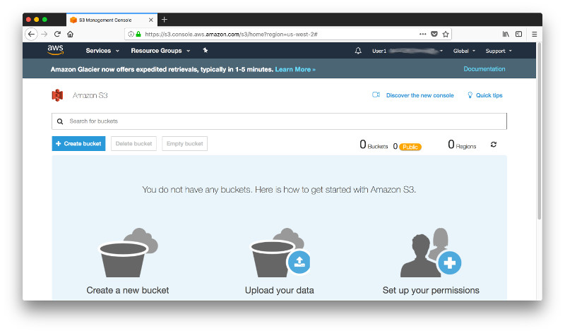
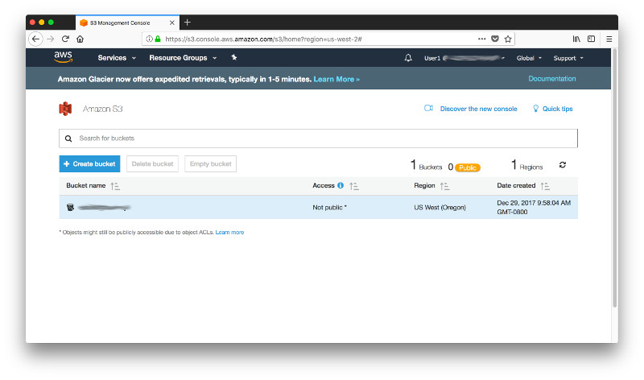
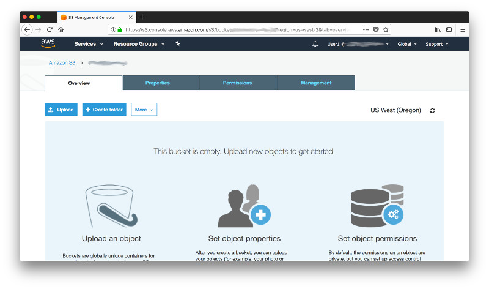
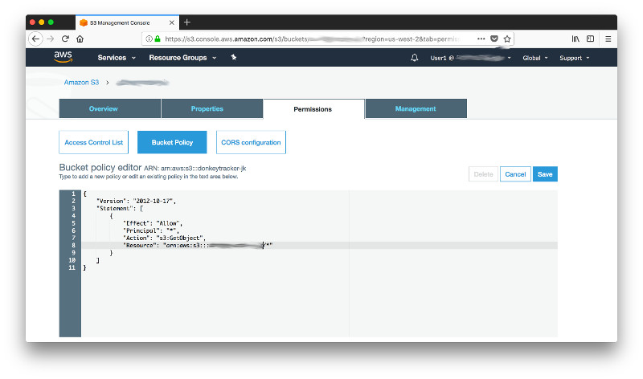
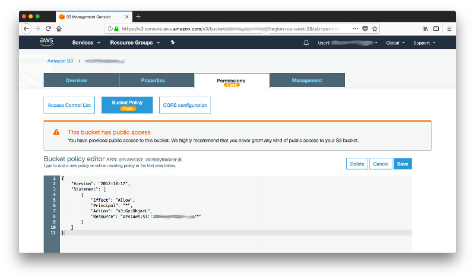
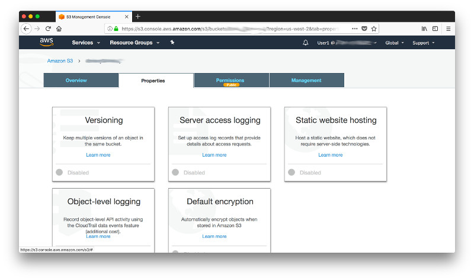
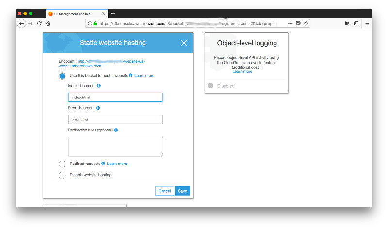
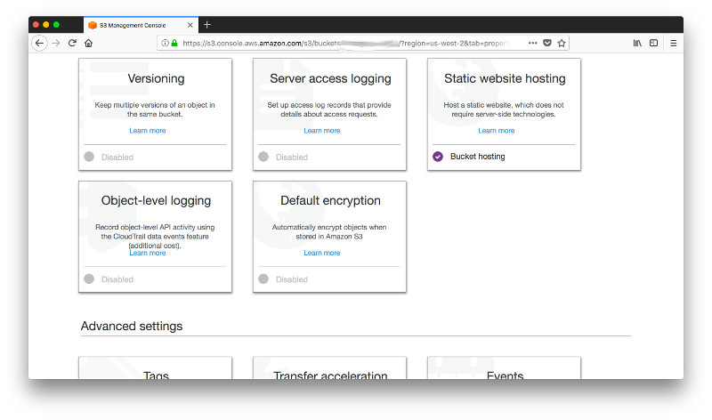

# Step 6: Website Hosting with S3

Log in to the **[AWS Console](https://console.aws.amazon.com)** and navigate to **S3**.  



Click on **Create Bucket** and give the bucket a name. This name has to be globally unique. Then click on **Create**.


In the S3 console click on your newly created bucket.



At this point the bucket is of course still empty but we can already start configuring certain properties. By default every bucket is only accessible by the account owner. In order to host a public website you'll need to grant additional priviliges. So activate the tabulator **Permissions**...



...and click on **Bucket Policy**. 


Paste the following bucket policy into the inline editor. Replace the string **[YOUR BUCKET NAME]** with the name you gave your bucket and click on **Save**.

```json
{
    "Version": "2012-10-17",
    "Statement": [
        {
            "Effect": "Allow",
            "Principal": "*",
            "Action": "s3:GetObject",
            "Resource": "arn:aws:s3:::[YOUR BUCKET NAME]/*"
        }
    ]
}
```



You will see a warning that this bucket has now public access but that's excatly what you need for website hosting. In order to configure the bucket to host your static website...



 ...click on the tabulator **Properties** and in the following screen on the card **Static website hosting**.



Make sure that the radio box **Use this bucket to host a website** is activated and enter **index.html** in the text box **Index document**. This is the HTML document that will be opened when you navigate to the root of your website. Now click on **Save** and take note of the **Endpoint** on top of the dialog. The endpoint is the URL you navigate in your browser and has the form **http://[YOUR BUCKET NAME].s3-website-us-west-2.amazonaws.com**.



Once the dialog closes, you'll find that the checkmark on the card **Static website hosting** is activated and you are ready to deploy your website. 



You can just upload your website directly from the S3 console or you can sync folders on your file system or from other S3 buckets using the AWS CLI. Open a terminal windows and execute 

```text
aws s3 sync s3://donkeytracker/website s3://YOUR_BUCKET_NAME --region YOUR_BUCKET_REGION
```

Now navigate to your newly created website to make sure it loads correctly. Don't worry for now about the functionality such as sign-up and sign-in, you'll tackle this in the next steps. 


If your website loads correctly you are ready to move on to [step 7](../Step-07).