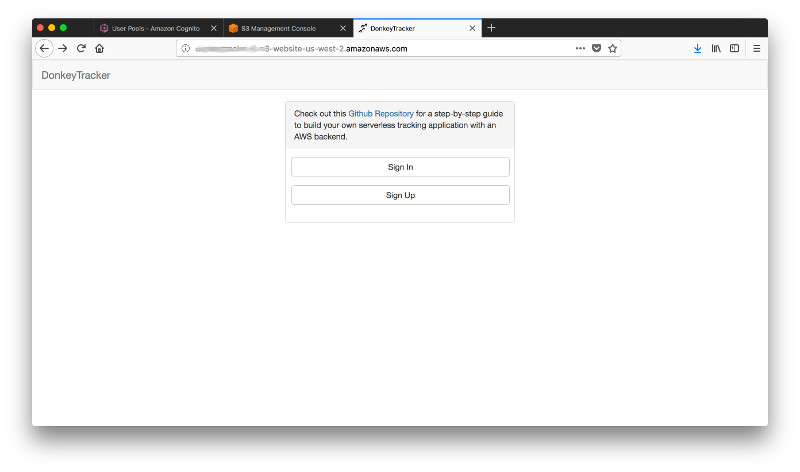
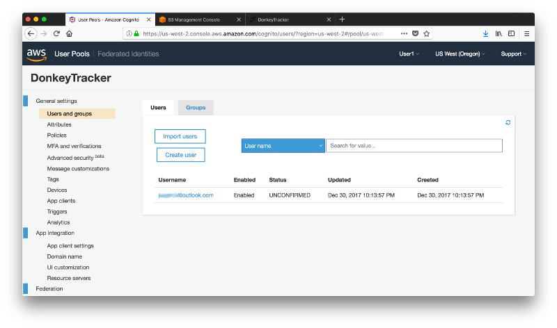
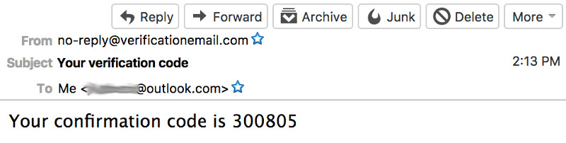
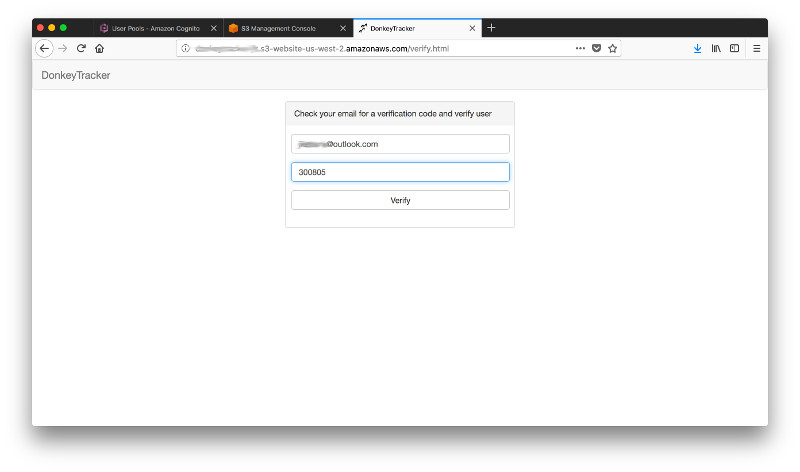
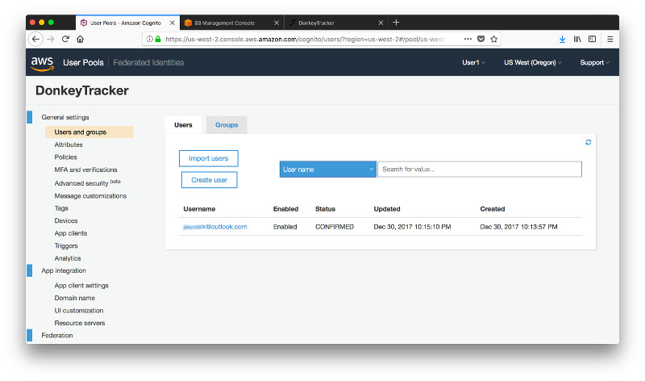
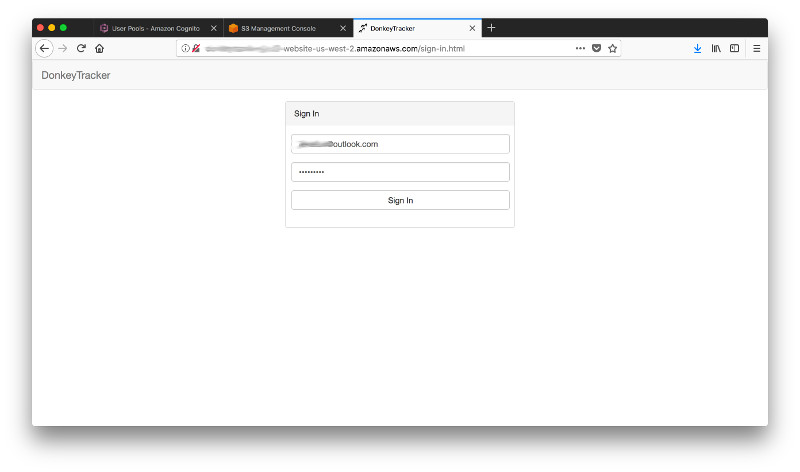
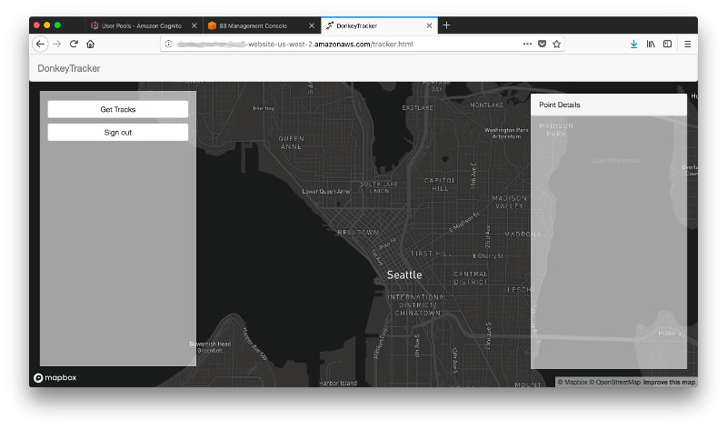

# Step 8: Adding Authentication and Authorization to your Website

You have a website hosted in S3 and a Cognito User Pool to authenticate and authorize access to the website. In this step you will bring the 2 together and enable users to sign up, verify their account through token they receive via email, sign in and sign out again. Before we get to the modifications let's have a look at the website first. For the user interface it leverages [Bootstrap](http://getbootstrap.com/) and for some of the functions it takes advantage of the [jQuery](https://jquery.com/) framework. 

There is **index.html** which will load when you navigate to the root of your website. It has 2 buttons that lead to **register.html** and **sign-in.html**.



**register.html** uses the [Amazon Cognito Identity SDK for JavaScript](https://docs.aws.amazon.com/cognito/latest/developerguide/setting-up-the-javascript-sdk.html) to manage the sign-up of new users and it also loads a config.js script that holds the details of the Cognito User Pool and App ID. Here is the relevant part of the [config.js](./Website/js/config.js)

```javascript
window._config = {
    cognito: {
        userPoolId: '[YOUR_USER_POOL_ID]', 
        userPoolAppClientId: '[YOUR_APP_ID]', 
        region: '[YOUR_AWS_REGION]'
    },
    ...
};
```

The registration is handled in the script [register.js](./Website/js/register.js) in less than 30 lines of code.


Go ahead, download [config.js](./Website/js/config.js) and replace the placeholder strings **[YOUR_USER_POOL_ID]**, **[YOUR_APP_ID]** and **[YOUR_AWS_REGION]** with the ones for your environment. While you are at it, also replace **[YOUR_MAPBOX_TOKEN]** with your own. Once you made the changes navigate to the S3 Console and upload the modified file to **[YOUR_S3_BUCKET]/js**.

Now reload the page **register.html** in your browser and sign-up. You will be automatically redirected to the verification page **verify.html** but let's pause here for a moment and navigate to the Cognto Console. You can see, that a new user was created but as of now it is still unconfirmed. You will change this right away. 



Check yor email (also look in the junk folder). You should have received a confirmation code. 



Enter this code along with the email address you used for the registration in the page **verify.html** and click **Verify**. This will automatically redirect you to the page **sign-in.html**. **verify.html** also uses the [Amazon Cognito Identity SDK for JavaScript](https://docs.aws.amazon.com/cognito/latest/developerguide/setting-up-the-javascript-sdk.html) and the same config.js as before. 



Let's pause again for a moment and refresh our Cognito user. The status is now changed to confirmed.



Switch back to the **sign-in.html** page. You guessed it - it also uses the [Amazon Cognito Identity SDK for JavaScript](https://docs.aws.amazon.com/cognito/latest/developerguide/setting-up-the-javascript-sdk.html) and the same config.js as before. 



Upon succesful authentication it will set a [JWT](https://jwt.io/) (JSON Web Token) and redirect you to the page **tracker.html**. The JWT looks like this.

Header (Algorithm and Token Type)

```json
{
    "kid": "6km5DL+JIfa7sRo2O+aJivd5j9apTafsvZ7qEHxbXsA=",
    "alg": "RS256"
}
```

Payload (Data)
```json
{
    "sub": "fbe73a76-c688-43c3-beee-22484e318aa7",
    "aud": "168ou4pq8o9gtcng6vktbom2a7",
    "email_verified": true,
    "event_id": "664fc7fc-ecf0-11e7-a767-d7f1e41dd422",
    "token_use": "id",
    "auth_time": 1514590291,
    "iss": "https://cognito-idp.us-west-2.amazonaws.com/[YOUR COGNITO USER POOL ID]",
    "cognito:username": "[YOUR USERNAME]",
    "exp": 1514593891,
    "iat": 1514590291,
    "email": "[YOUR EMAIL]"
}
```

**tracker.html** will always check for the presence of the token. If it isn't there, you will be redirected to **sign-in.html**. You should see the map load and you will be able to sign out but the button **Get Tracks** will not work yet. You will fix that in [step 9](../Step-09).


