# Step 9: Create an API for your Website

aa

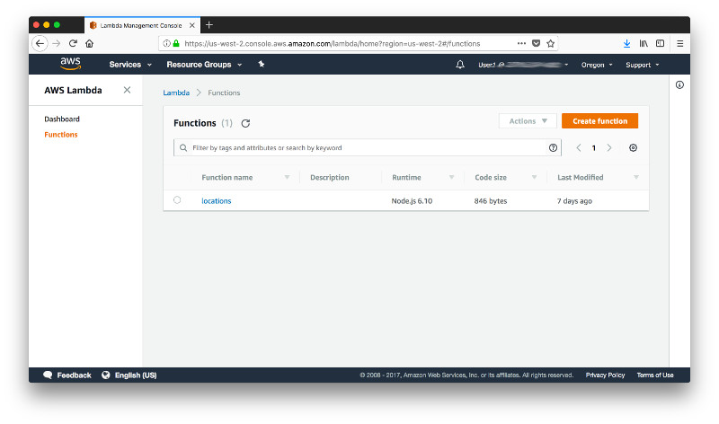

aa

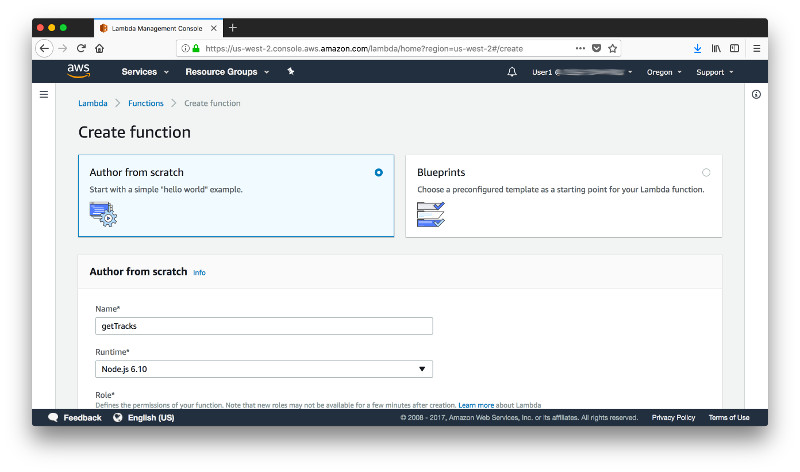

aa

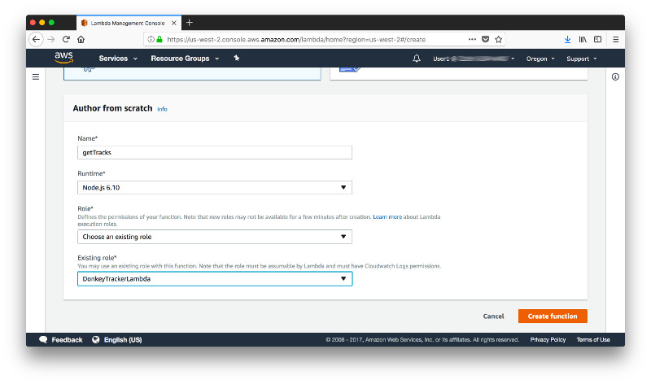

aa


```javascript
var AWS = require("aws-sdk");

AWS.config.update({
    region: "us-west-2",
    endpoint: "https://dynamodb.us-west-2.amazonaws.com"
});

var docClient = new AWS.DynamoDB.DocumentClient();

exports.handler = (event, context, callback) => {
    const done = (err, res) => callback(null, {
        statusCode: err ? '400' : '200',
        body: err ? err.message : JSON.stringify(res),
        headers: {
            'Content-Type': 'application/json',
            'Access-Control-Allow-Origin': '*'
        },
    });
  
    var params = {
      ExpressionAttributeNames:{
        "#u": "uuid",
        "#t": "timestamp"
      },
      ExpressionAttributeValues: {
        ':u': event.queryStringParameters.u,
        ':t' : event.queryStringParameters.t
       },
     KeyConditionExpression: '#u = :u and begins_with(#t, :t)',
     ProjectionExpression: '#t, latitude, longitude, speed',
     TableName: 'Tracks'
    };
    
    docClient.query(params, done);
};
```

aa

[Reserved Words](https://docs.aws.amazon.com/amazondynamodb/latest/developerguide/ReservedWords.html)

[Expression Attribute Names](https://docs.aws.amazon.com/amazondynamodb/latest/developerguide/Expressions.ExpressionAttributeNames.html)

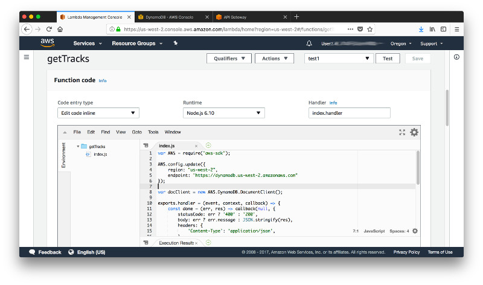

aa

```json
{
  "httpMethod": "GET",
  "queryStringParameters": {
    "u": "D4F2CD57-9739-4238-84EC-DA0A4C5324EF",
    "t": "2017-12-31"
  }
}
```

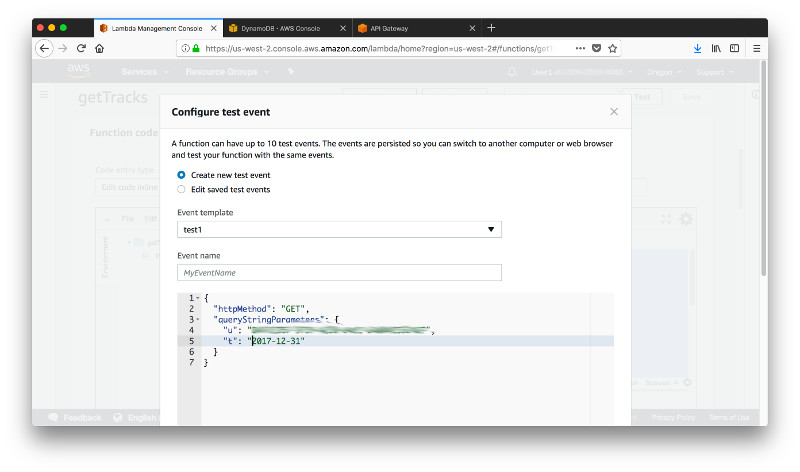

aa

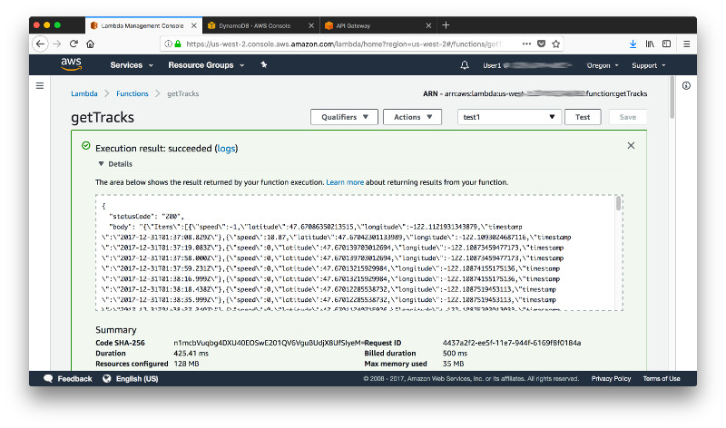

aa

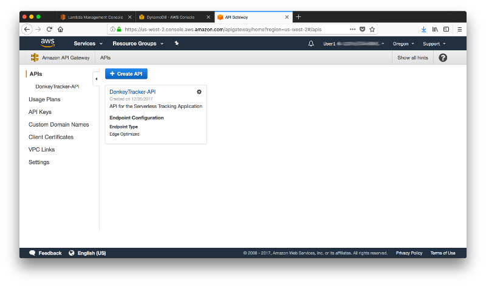

aa

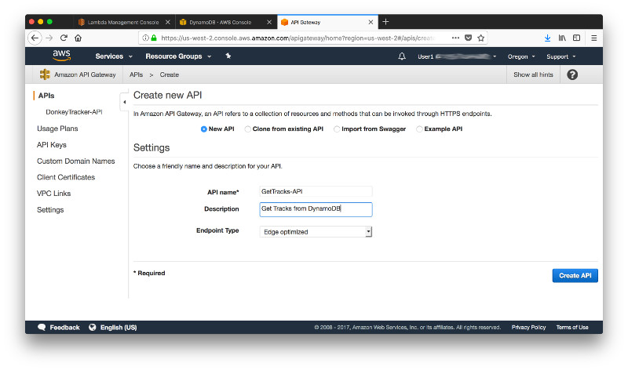

aa

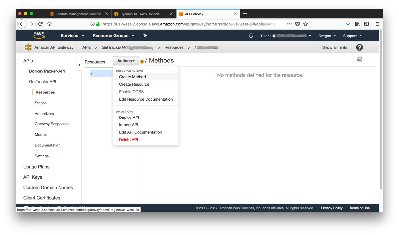

aa

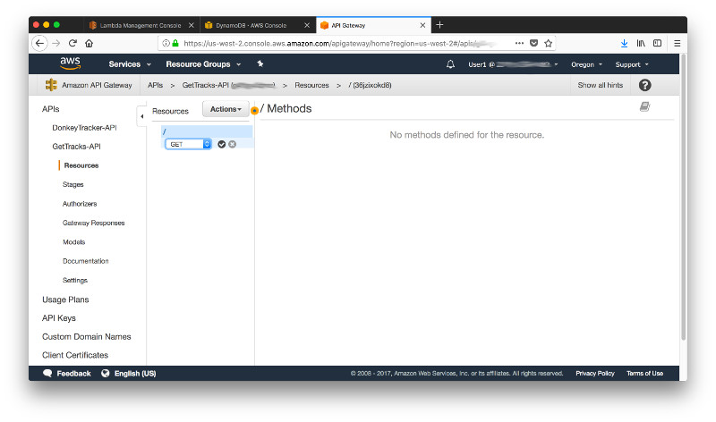

aa

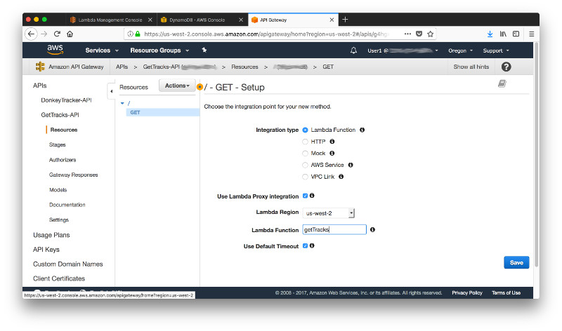

aa

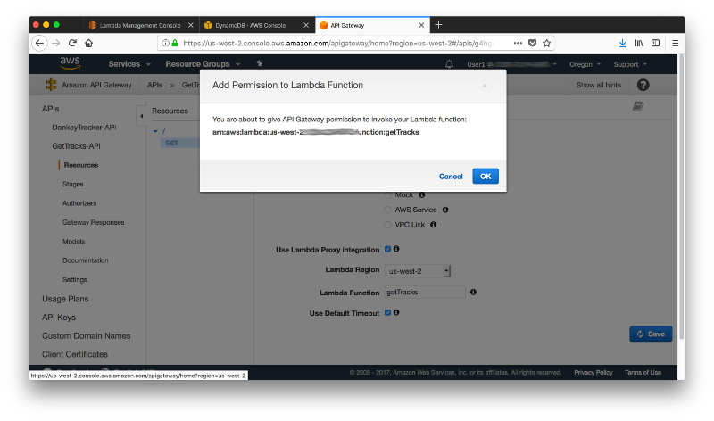

aa

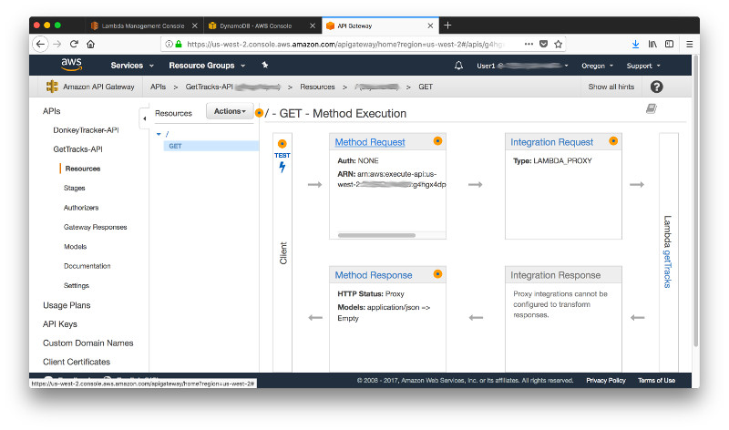

aa

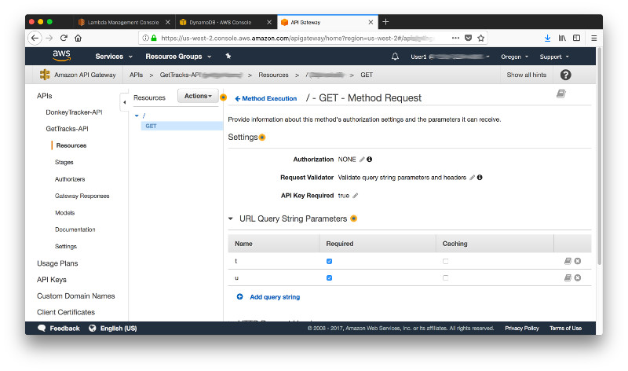

aa

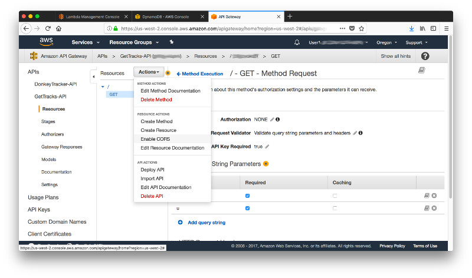

aa

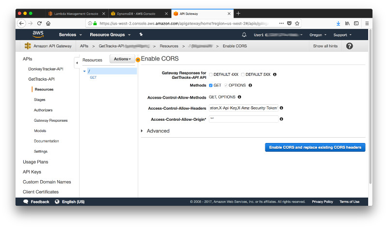

aa


aa

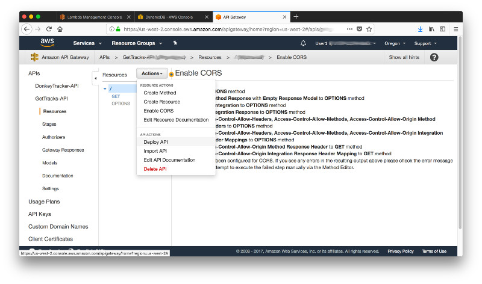

aa

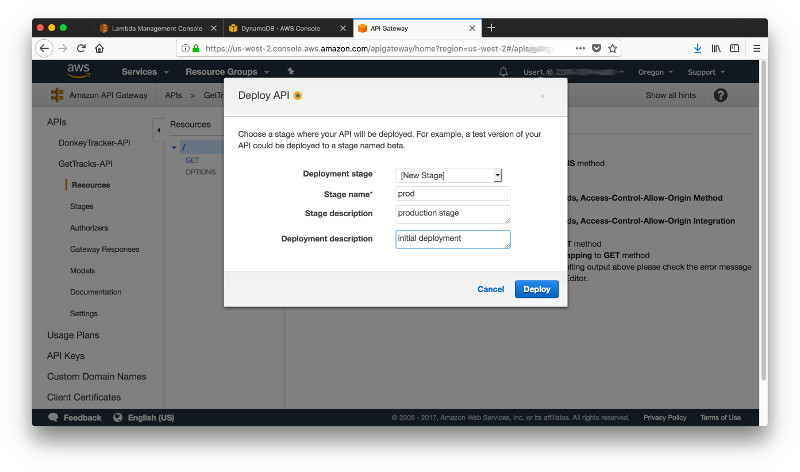

aa

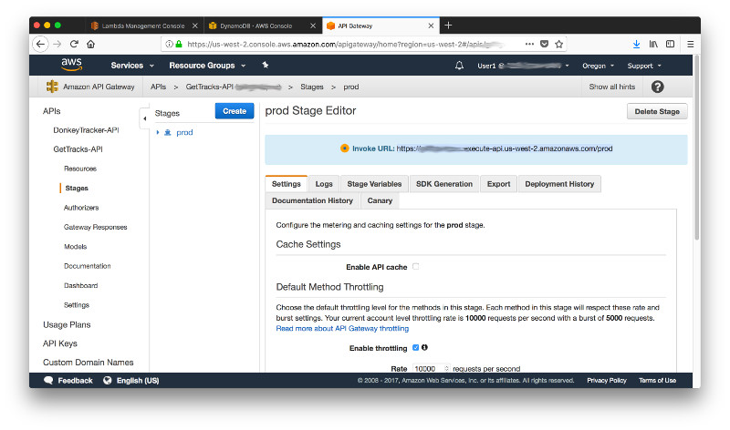

aa

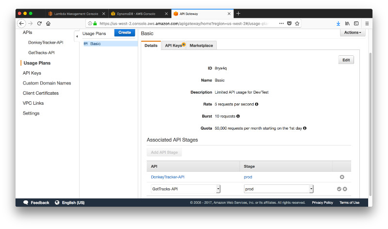

aa

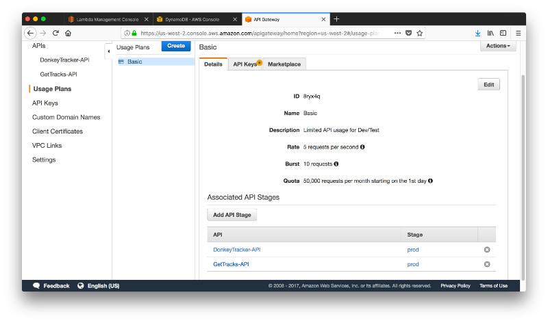

aa

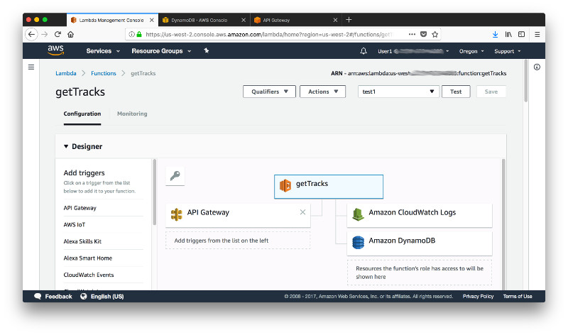

aa


aa

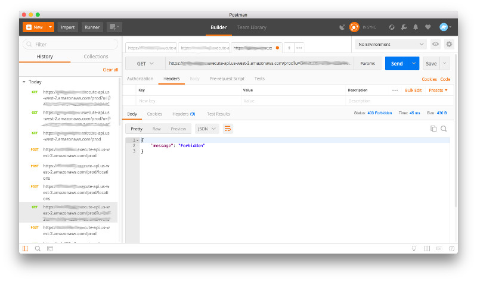

aa

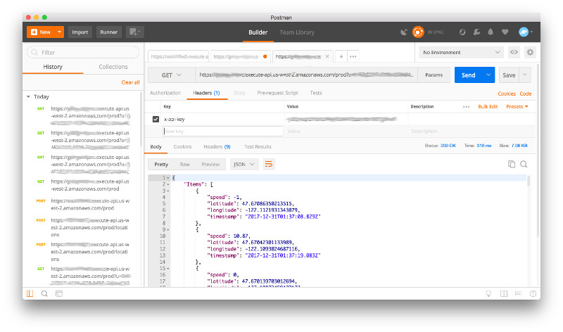

aa