# Step 12 (optional): Set up a Domain

Log in to the **[AWS Console](https://console.aws.amazon.com)**, navigate to **Route 53**...

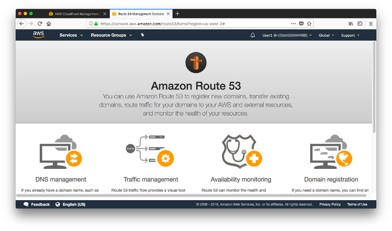

...and click on **Get started now** under **Domain registration**.

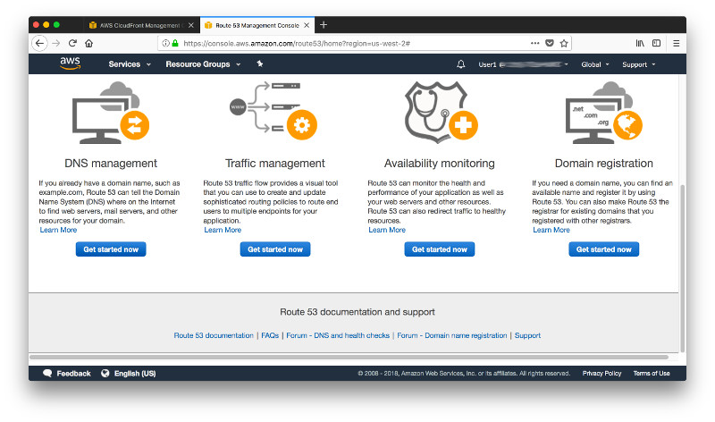

Click on **Register Domain**,...

...type the name of the domain you want to register and pick the top-level domain extension (here: .info). Click **Check** to test the availability of the domain name...

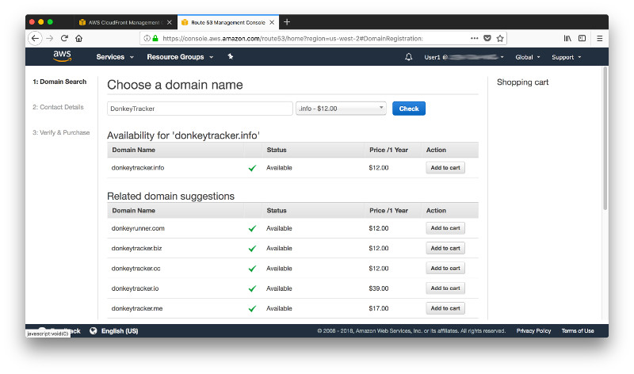

 ...and then click on **Add to cart**.

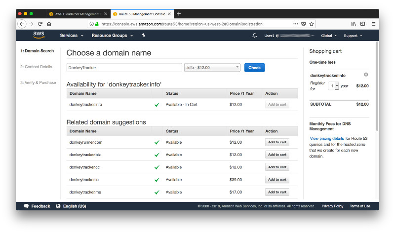

Scroll down to the bottom of the page and click on **Continue**.

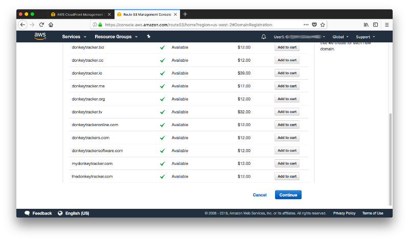

Fill in the contact details of the **registrant**...

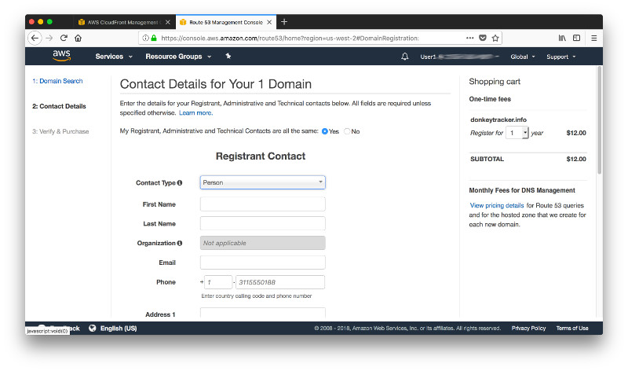

...and click on **Continue**.

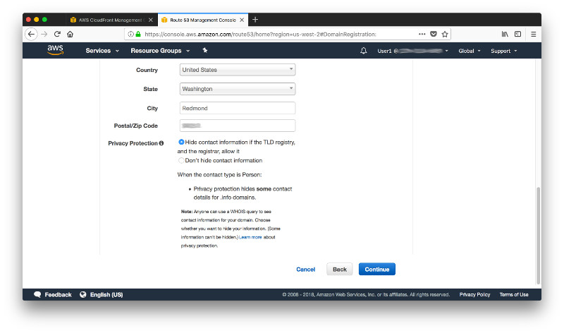

Tick the check-box to indicate you accept the **Terms & Conditions** and finalize the purchase of the domain name by clicking on **Complete Purchase**.

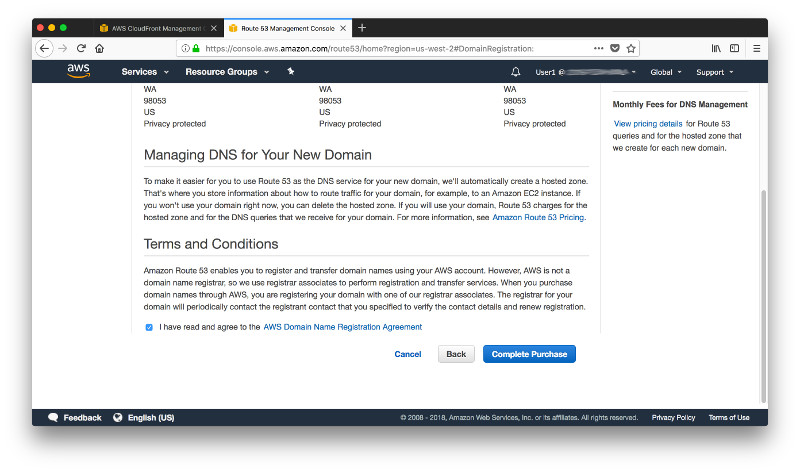

Route 53 informs you about the next steps, which include the formal registration of the domain as well as an email confirmation that you will have to acknowledge. Click on **Go To Domains** to close this screen...

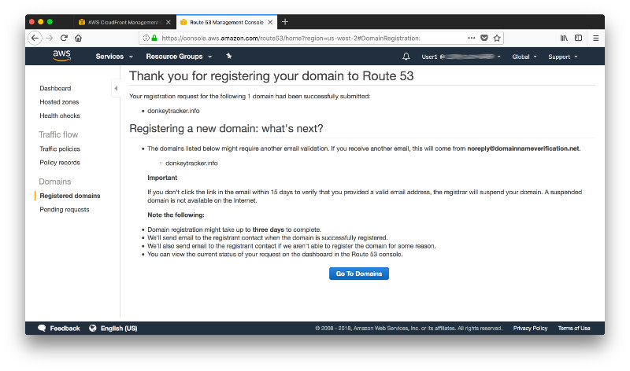

...and see the status of the registration which in the screen below shows still as **in progress**.

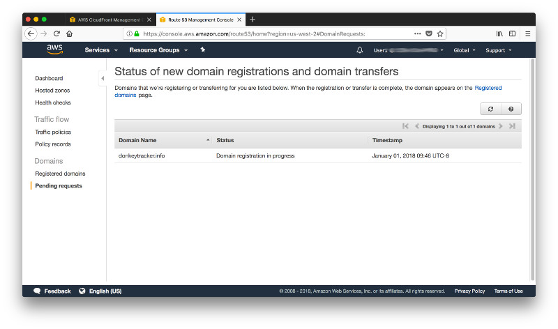

Meanwhile you should have received an email that prompts you to confirm the contact details (or at least the email-address) of the registrant. Click on the link in the email to confirm that it is valid and yours.

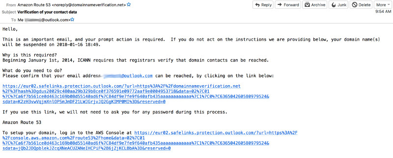

You should see a screen that indicates your email verification is now complete.

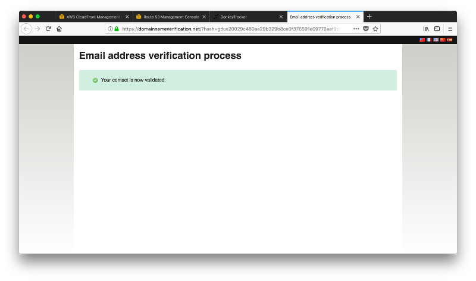

Shortly thereafter you will also receive a 2nd email confirming the registration.

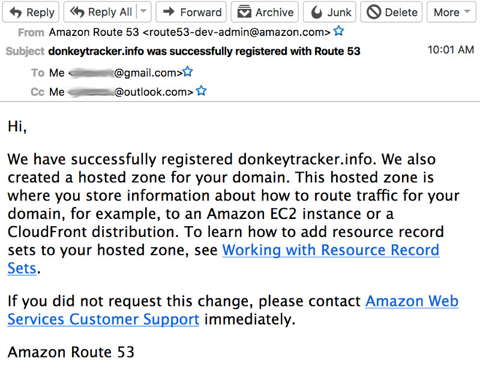

At this time your domain name request transitioned from **Pending requests** to **Registered domains**.

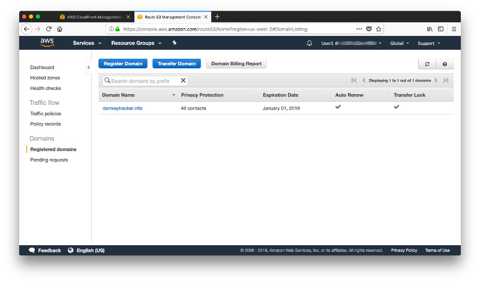

Now that you own the domain you can start pointing it at your CloudFront distribution. Open a 2nd browser tab, navigate to the CloudFront Console, click on your distribution and then on **Edit** in the tab **General**.

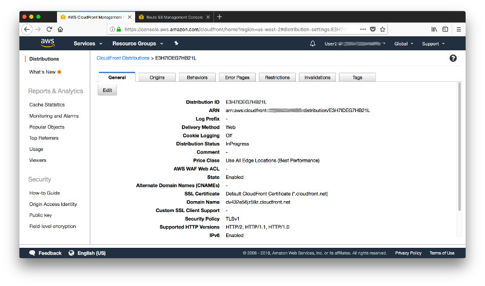

Under **Alternate Domain Names** add the name of your newly registered domain.

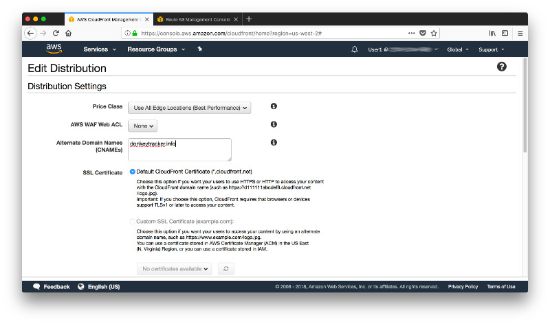

Scroll down and click on **Yes, Edit** to confirm the change.

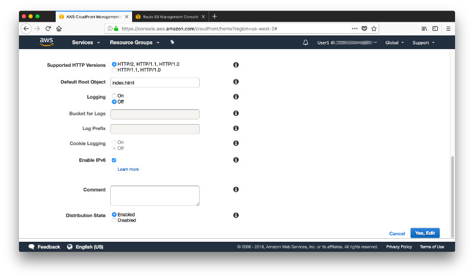

Back in the Route 53 Console select the **Dashboard** in the navigation tree to the left and click on **Hosted zones**.

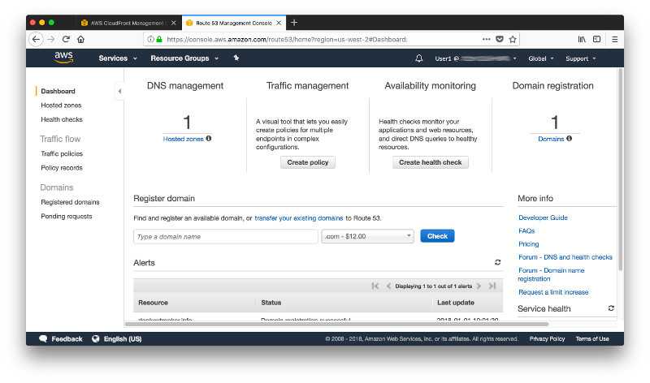

Click on your domain name...

...and then on **Create Record Set**. 

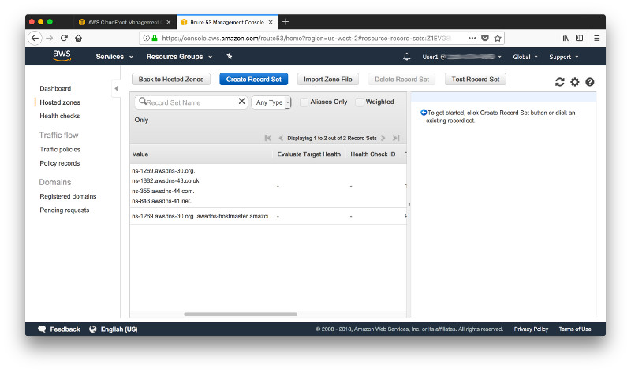

You will first create a record for the IP v4 address of your domain without the prefix **www**. So, go ahead, leave the name blank, pick **Type A**, activate the radio box for **Alias Yes** and then select your CloudFront domain from the list of **Alias Targets** before clicking on **Create**.

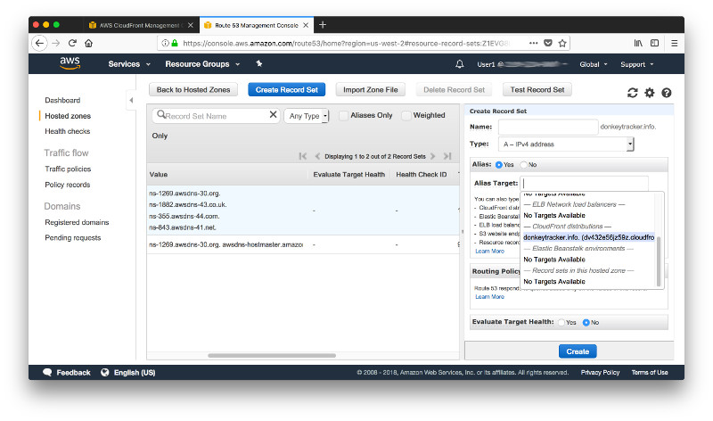

Once the record is created, click on **Create Record Set** again to create a record for the IP v6 address of your domain without the prefix **www**.

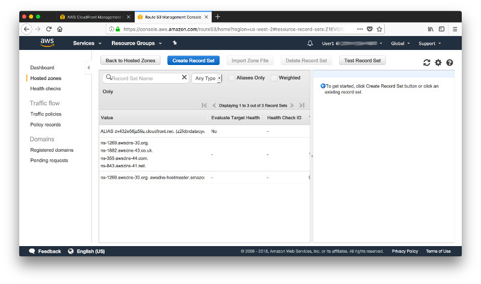

Leave the name blank again, pick **Type AAAA**, acivate the radio box for **Alias Yes** and then select your CloudFront domain from the list of **Alias Targets** before clicking on **Create** once more.

With the 2 records in place open a new browser tab...

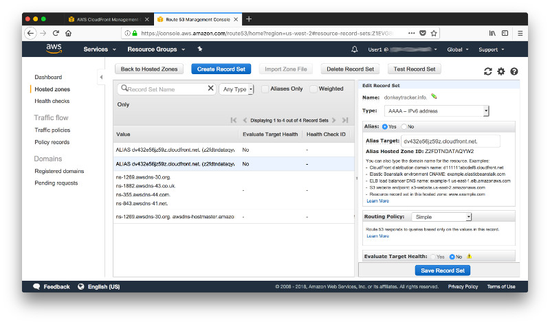

...and verify that you can now reach your website under the newly created domain name. 

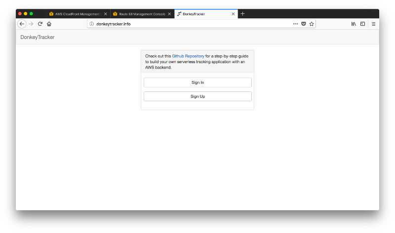

At present, you can reach your website under the naked domain name that you registered but it will fail with the prefix **www**. To some extend it is a matter of taste if you have a domain with or without the prefix **www** - or both. If you want to have them both, head over to [step 13](../Step-13) next.