# Step 14 (optional): Adding SSL Support

[Coming Soon]

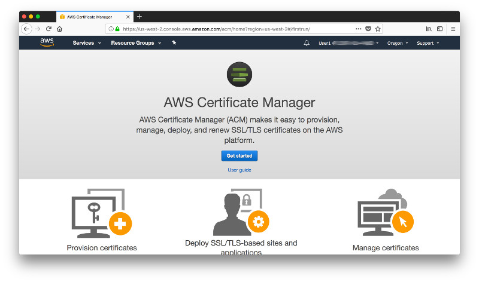

a

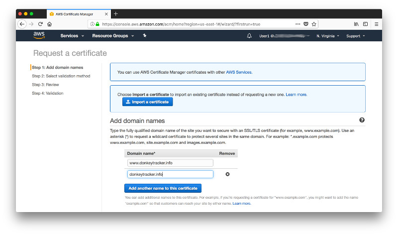

aa

[Supported Regions](https://docs.aws.amazon.com/acm/latest/userguide/acm-regions.html).

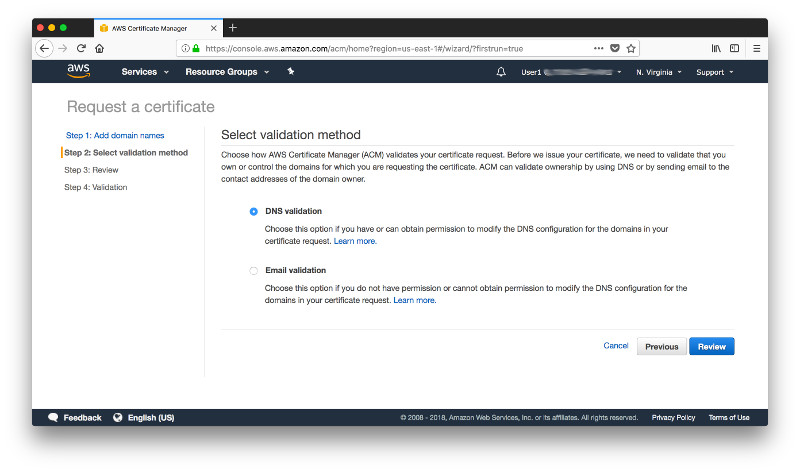

a

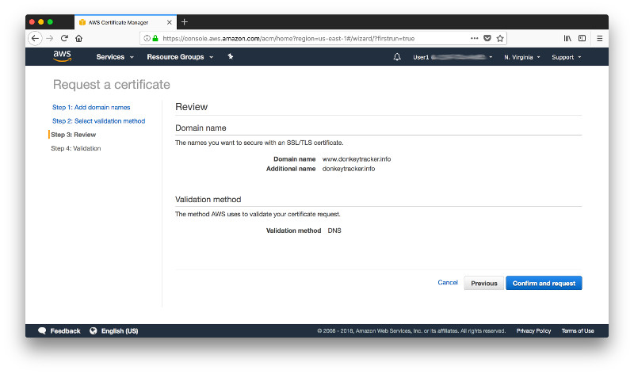

a

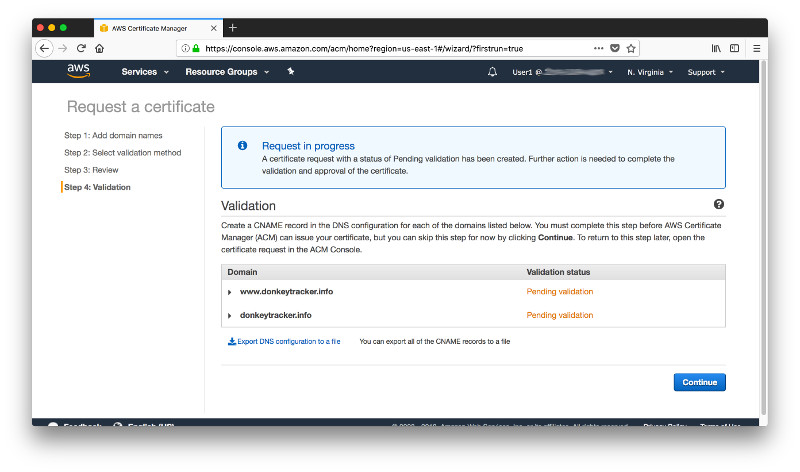

a

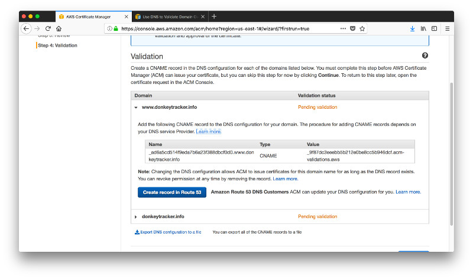

a

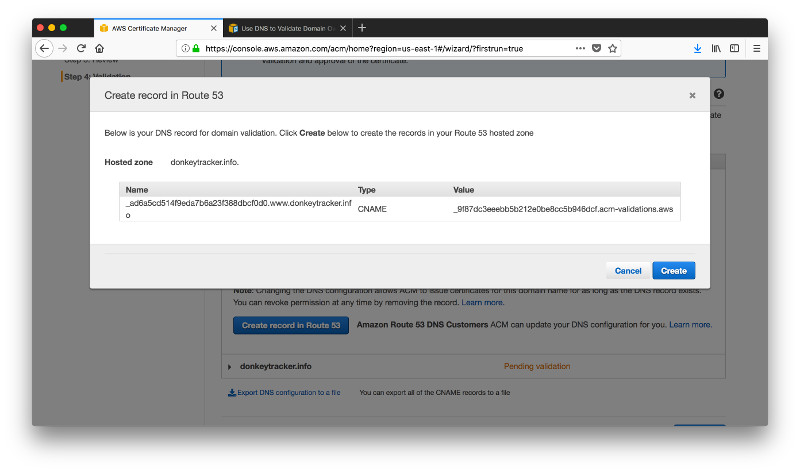

a

a

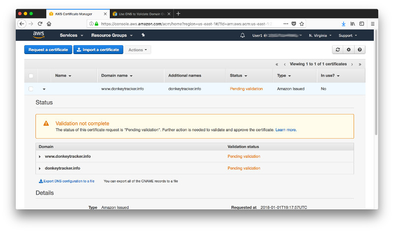

a

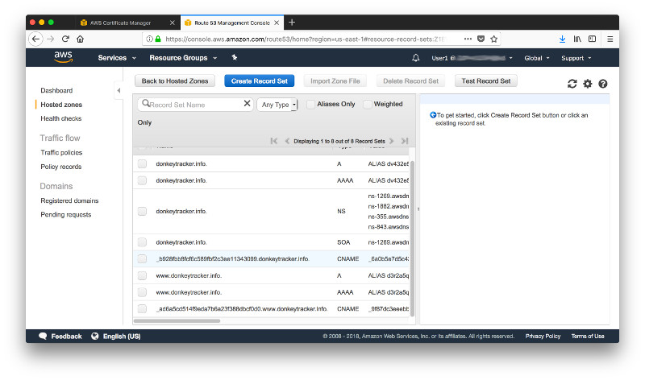

a

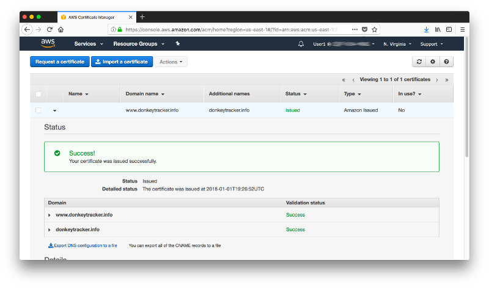

a

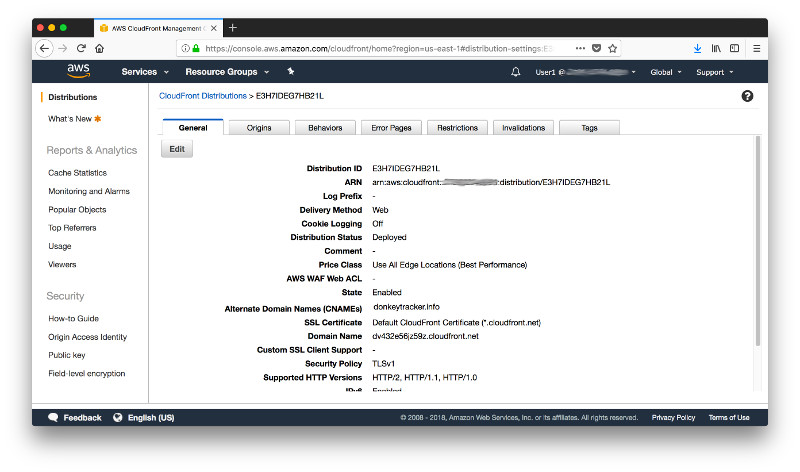

a

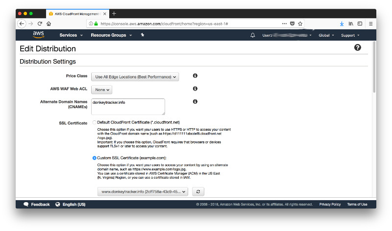

a

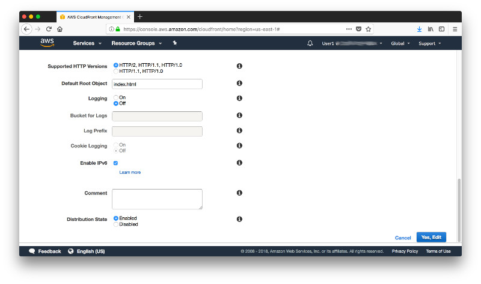

a

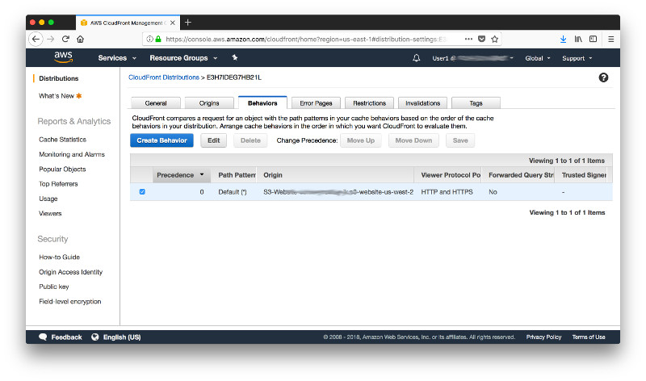

a

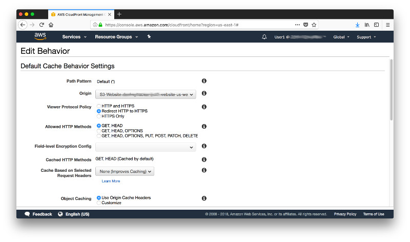

a

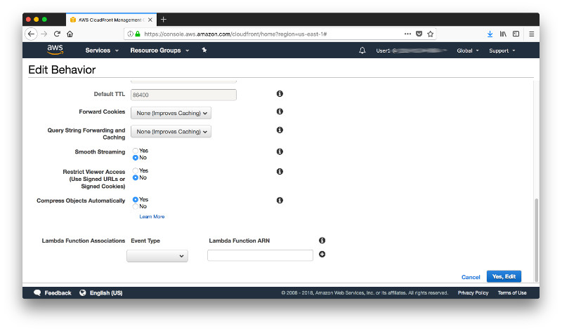

a

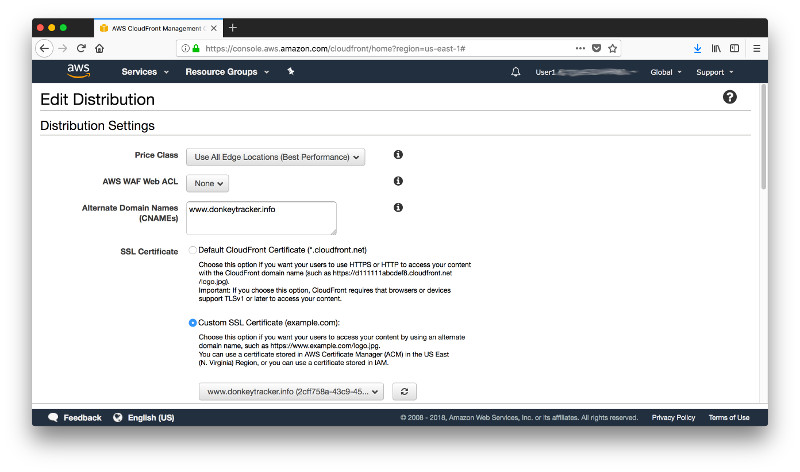

a

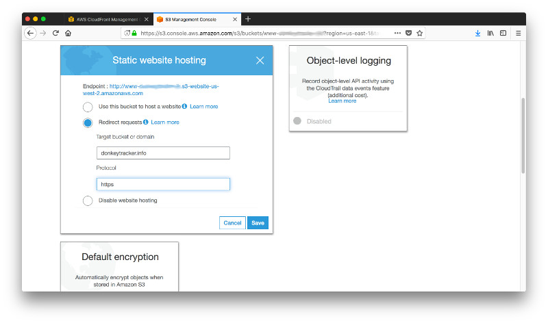

a

a